# SmartShunt Display

Live battery readings from a **Victron SmartShunt**, on a screen you can glance at: a moving power-flow picture of charger, battery and loads, plus state of charge, voltage, current, power, time remaining and more. There are four versions in this repository:

- **Arduino display:** a stand-alone 2.8" touch screen built from an Arduino UNO R4 WiFi and a Jaycar XC4630 shield. No phone needed.
- **Raspberry Pi display:** the same dashboard on a Raspberry Pi with any HDMI or DSI touch screen, from 3.5" to a full-size monitor.
- **Android app:** the same dashboard on a phone or tablet, for example a spare phone mounted in the van or boat.
- **T-Dongle-S3:** a basic readout on the 0.96" screen of a LILYGO T-Dongle-S3 USB dongle, set up from a PC through its SD card.

All four read the shunt's Bluetooth *Instant Readout* broadcasts, so there's no pairing and no cloud. They work at the same time as each other and as VictronConnect.

<p align="center">
  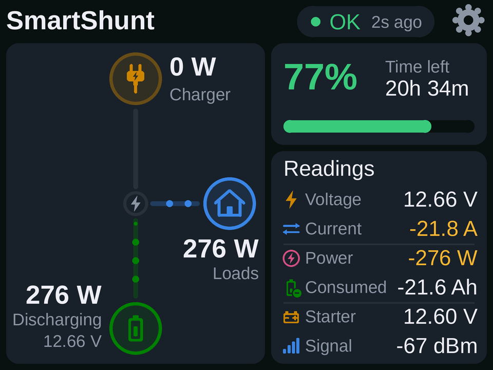
  &nbsp;
  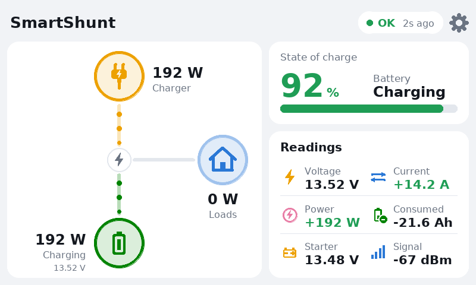
  &nbsp;
  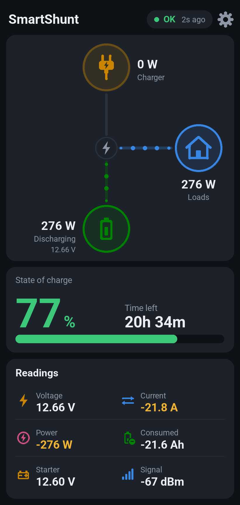
</p>
<p align="center"><sub>The Arduino display, the Raspberry Pi display and the Android app</sub></p>

<p align="center">
  <b>Just want the app?</b><br>
  <a href="https://play.google.com/store/apps/details?id=dngsoftware.shuntdisplay"></a>
</p>

---

## Contents

- [Which one?](#which-one)
- [Before you start: your shunt's MAC address and key](#before-you-start-your-shunts-mac-address-and-key)
- [Extra Victron chargers](#extra-victron-chargers)
- [Arduino display](#arduino-display)
  - [Screens](#screens) · [Hardware](#hardware) · [Remote screen](#mounting-the-screen-away-from-the-board) · [How it works](#how-it-works) · [Getting started](#getting-started) · [Using the display](#using-the-display) · [Settings reference](#settings-reference) · [Status messages](#status-messages) · [Troubleshooting](#troubleshooting) · [Technical notes](#technical-notes)
- [Raspberry Pi display](#raspberry-pi-display)
  - [Pi screens](#pi-screens) · [What you need](#what-you-need) · [Installing on the Pi](#installing-on-the-pi) · [Pi settings](#pi-settings) · [Full Pi documentation](ShuntDisplayPi/README.md)
- [Android app](#android-app)
  - [App screens](#app-screens) · [Building the app](#building-the-app) · [First run](#first-run) · [App settings](#app-settings) · [App status messages](#app-status-messages) · [Languages](#languages)
- [T-Dongle-S3 display](#t-dongle-s3-display)
- [Sharing settings](#sharing-settings)
- [Victron Instant Readout format](#victron-instant-readout-format)
- [Repository layout](#repository-layout)
- [Credits](#credits)

---

## Which one?

| | Arduino display | Raspberry Pi display | Android app |
|---|---|---|---|
| **Hardware** | Arduino UNO R4 WiFi + Jaycar XC4630 shield | Any Raspberry Pi with Bluetooth + an HDMI or DSI touch screen | Any phone or tablet with Android 8.0+ and Bluetooth LE |
| **Screen** | 2.8", 320×240, resistive touch | Any size or resolution; landscape, portrait, rotatable | Whatever the phone has; portrait or landscape |
| **Set-up** | Touch keypad on the screen, or `CONFIG.TXT` on an SD card | Touch keypad and **Find nearby** on the screen, or a text file on the SD card | Settings screen, **Find nearby** list, key pasted from VictronConnect |
| **Always on** | Yes, powered from 5 V. Screen timeout blanks to black | Yes, starts at boot. Screen timeout switches the backlight off where the screen allows | Optional keep-awake while the app is open |
| **Themes** | Dark or light | Dark or light | Dark, light, or follow the phone |
| **Languages** | English | 45 languages | 45 languages |
| **Extra chargers** | Up to 2 Victron chargers | Up to 2 Victron chargers | Up to 2 Victron chargers |
| **Get it** | Build it: parts from Jaycar, sketch from [`ShuntDisplayR4/`](ShuntDisplayR4) | Install on Raspberry Pi OS from [`ShuntDisplayPi/`](ShuntDisplayPi) | [Google Play](https://play.google.com/store/apps/details?id=dngsoftware.shuntdisplay), or build from [`ShuntDisplayAndroid/`](ShuntDisplayAndroid) |

All three show the same readings with the same colour rules, and they can exchange settings through `CONFIG.TXT` ([see below](#sharing-settings)).

---

## Before you start: your shunt's MAC address and key

All three versions need two things from **VictronConnect**. Open the SmartShunt → ⚙ Settings → ⋮ menu → **Product info**:

1. Turn on **Instant readout via Bluetooth**.
2. Tap **Show** next to *Instant readout details*.
3. Note the **MAC address** (12 characters) and the **encryption key** (32 characters).

The Raspberry Pi display and the Android app can find the MAC address for you, and the Android app can pick up the key if you copy it in VictronConnect.

---

## Extra Victron chargers

Optional, on all three versions. The shunt measures only what goes in and out of the battery, so on its own the display can't tell which charger is running, or how much the loads are using while the battery charges. Victron chargers that send *Instant readout* broadcasts can be added (up to two), and each gets its own node in the flow picture with its output and charge stage:

| Charger | Shown as | What it reports |
|---|---|---|
| **Blue Smart IP22** (and other Victron AC chargers; firmware v3.61 or newer) | Mains, plug icon | Output volts and amps (all outputs), charge stage, errors |
| **SmartSolar / BlueSolar MPPT** | Solar, sun icon | Battery volts and amps, charge stage, errors |
| **Orion XS** DC-DC charger | DC-DC, car icon | Output volts and amps, charge stage, errors |

Set each one up like the shunt: in VictronConnect open the charger → ⚙ → ⋮ → **Product info**, turn on **Instant readout via Bluetooth**, then **Show** for the MAC address and key. Enter them under **Chargers** in settings (on the Pi and Android, **Find nearby** lists the chargers in range).

<p align="center">
  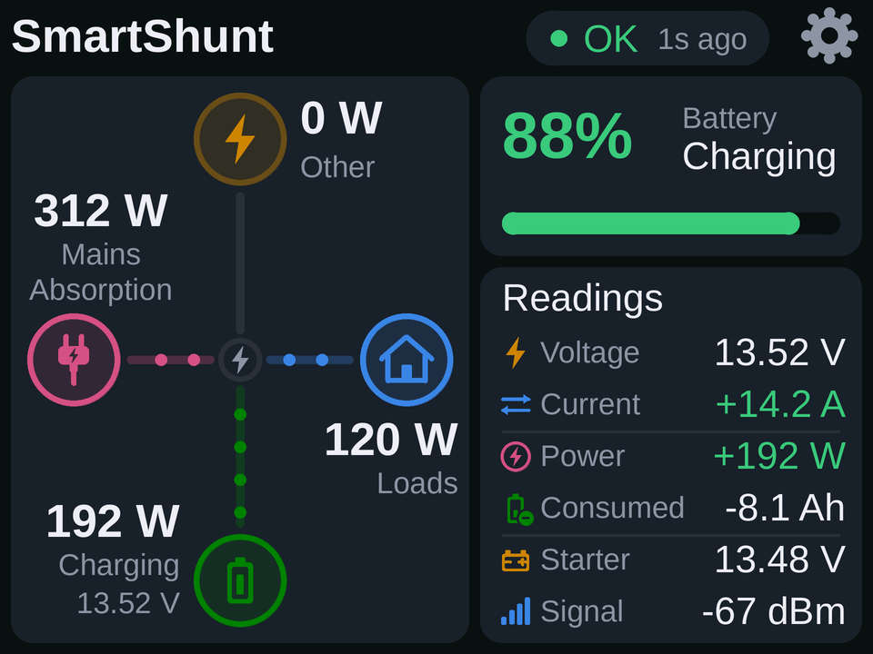
  &nbsp;
  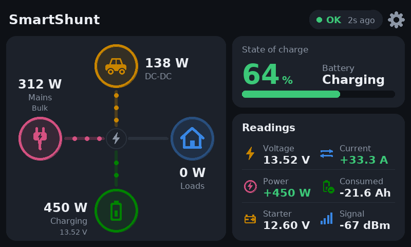
</p>
<p align="center"><sub>Left: the mains charger runs the loads and charges the battery. Right: the battery takes 450 W, the mains charger gives 312 W, so the other 138 W comes from a DC-DC charger the display can't hear.</sub></p>

**How the numbers are worked out.** With *K* watts coming from the Victron chargers and *P* watts going into the battery (from the shunt):

- **Loads** = *K* − *P*, when that's more than zero: whatever the chargers give that doesn't reach the battery.
- **Other charging** = *P* − *K*, when that's more than zero: the battery is getting more than the Victron chargers give, so something else is charging it, such as a non-Victron DC-DC charger (a Redarc, for example) or an alternator. It's shown on its own node at the top. Its name and icon can be set in settings: **Automatic** (*Other*), **DC-DC**, **Solar**, **Mains** or **Alternator**.

Both of those are the smallest amount that fits the readings. If an unknown charger and the loads are both running, only their difference can be seen: for example, a DC-DC charger giving 200 W while the fridge uses 60 W shows as 140 W of other charging and 0 W of loads.

**Where they go.** The first charger goes on the left of the flow picture, and the "other" source stays at the top. With two Victron chargers, the second takes the top place and there's no "other" node. If a charger goes quiet for longer than *No signal after*, its node shows **No signal** and it's left out of the sums.

**With no extra chargers**, nothing changes: the dashboard is the same as before, with one **Charger** node for whatever is charging the battery.

---

# Arduino display

A stand-alone battery monitor screen. The Arduino UNO R4 WiFi picks up the shunt's Bluetooth broadcasts and shows the readings on a 2.8" touch screen.

Everything is set up on the screen itself: tap the cog, type in your shunt's MAC address and key on the built-in keypad, and you're done. Settings are kept in the board's own memory, and optionally on an SD card as a plain text file you can edit on a computer.

## Features

- **Power-flow dashboard:** a live picture of the charger, the battery and your loads, with dots moving along the lines in the direction the power is flowing. The shunt measures only the battery, so it can't tell mains from solar: there's a single **Charger** input covering whatever is charging the battery.
- **Extra Victron chargers (optional):** add a Blue Smart IP22, SmartSolar MPPT or Orion XS and it gets its own node with its output and charge stage, and the loads are worked out even while charging ([details](#extra-victron-chargers)).
- **Readings card:** voltage, current, power, consumed Ah, the aux input (starter battery voltage, midpoint voltage or temperature) and signal strength, all straight from the shunt. Nothing depends on the time of day, so no internet or clock is needed.
- **State of charge** big and colour-coded, with the time left while discharging. The title shows your monitor's model (SmartShunt, BMV-712…).
- **No pairing:** uses Victron's *Instant Readout* broadcasts, so it works alongside the VictronConnect app and any number of other displays.
- **Colour-coded:** state of charge turns amber and red below levels you choose, and current and power are green while charging and amber while discharging. Alarms are shown by name.
- **Touch-screen setup:** a settings cog, a hex keypad for the MAC address and key, and toggles and steppers for everything else.
- **Settings survive without an SD card:** they're stored in the R4's built-in EEPROM, and mirrored to `CONFIG.TXT` on the SD card when one is fitted.
- **Screen timeout:** the screen goes black after a set time and wakes on a tap, or by itself if the shunt raises an alarm.
- **Handles problems:** shows "No signal" when the shunt goes quiet, flags a wrong key, and recovers if Bluetooth fails to start.
- **Flicker-free updates:** only values that change are redrawn, and the flow dots move without redrawing the rest of the screen.
- **Works with both XC4630 versions:** current shields use an ILI9341 chip and older batches a UC8230. The chip is detected automatically at start-up, so screens can be swapped freely.

## Screens

<table>
  <tr>
    <td align="center">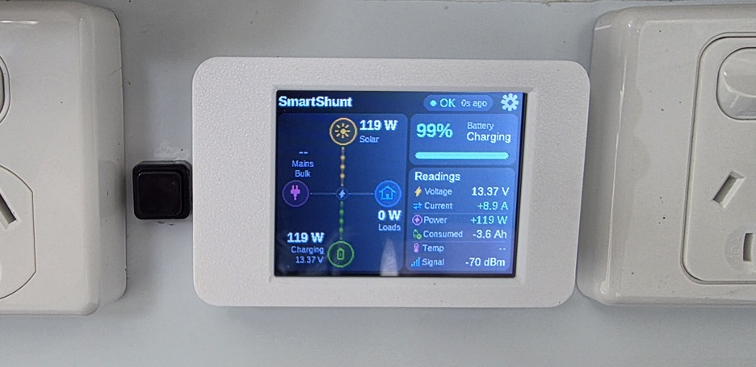<br><sub>Arduino version installed</sub></td>
  </tr>
</table>

### Dashboard

<table>
  <tr>
    <td align="center"><br><sub>Discharging: power flows from the battery to the loads</sub></td>
    <td align="center">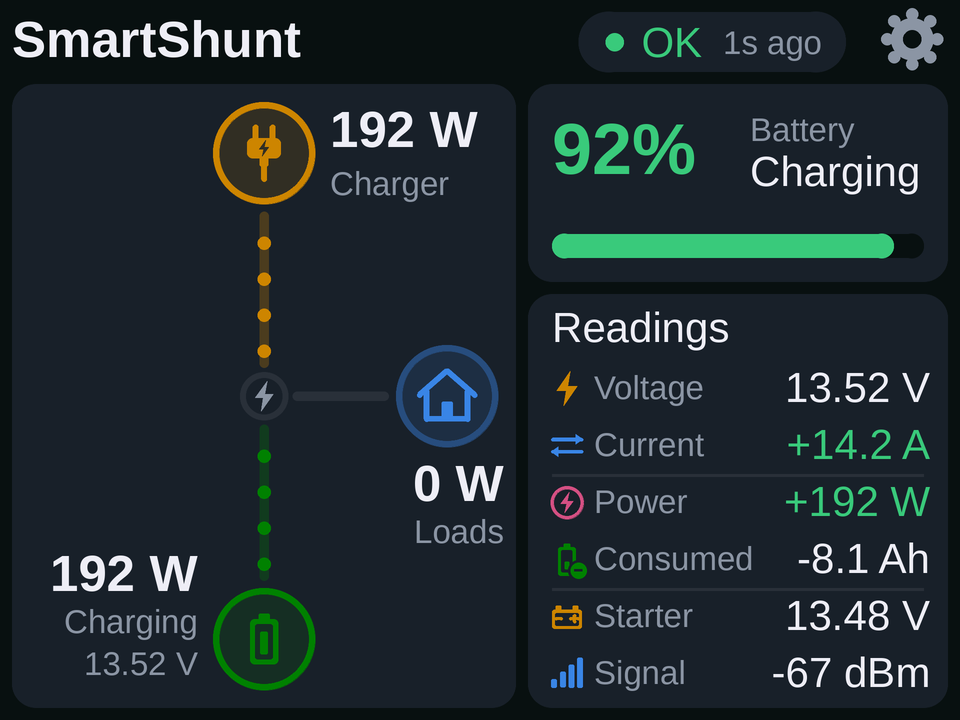<br><sub>Charging: power flows from the charger into the battery</sub></td>
  </tr>
  <tr>
    <td align="center">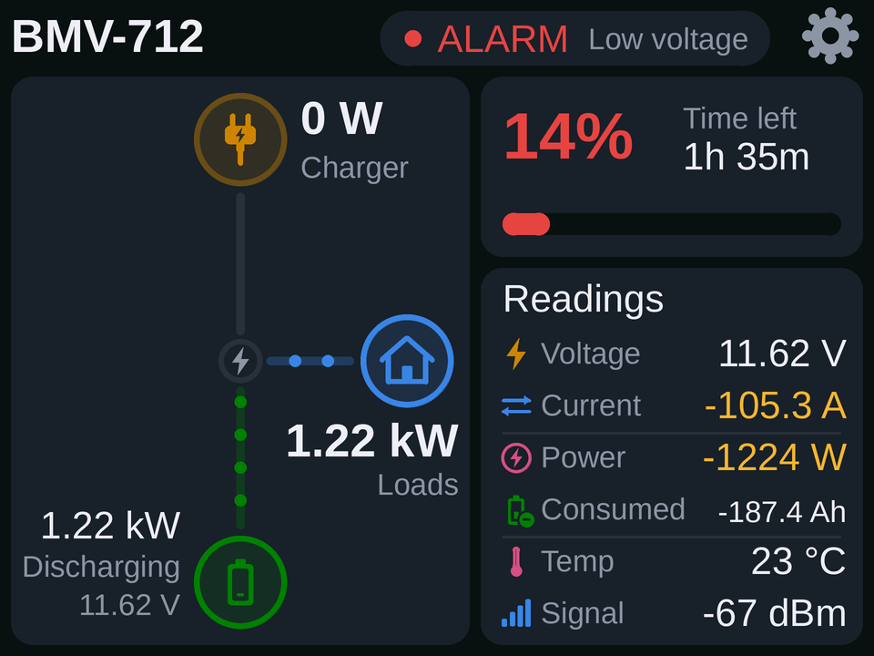<br><sub>A BMV-712 with a low-voltage alarm and temperature sensor</sub></td>
    <td align="center">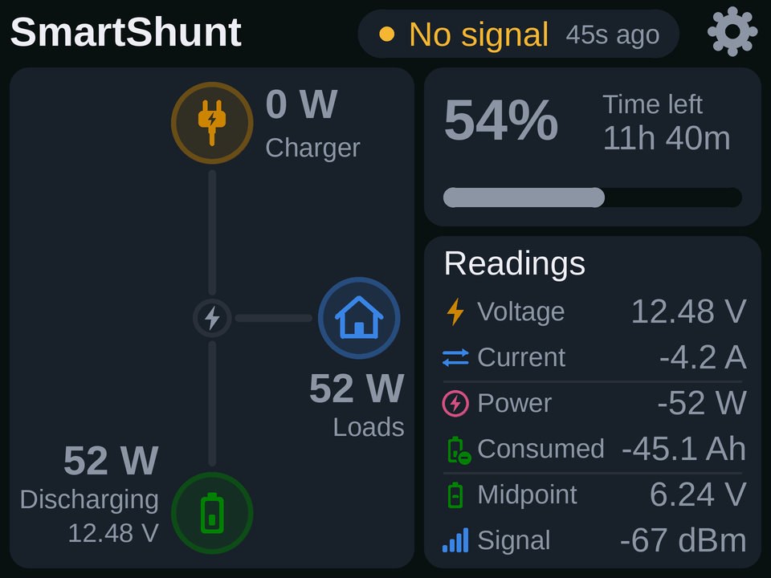<br><sub>Signal lost: values turn grey</sub></td>
  </tr>
  <tr>
    <td align="center"><br><sub>With a Blue Smart IP22 added: it runs the loads and charges the battery</sub></td>
    <td align="center">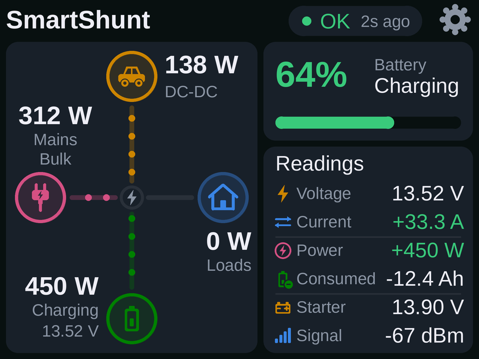<br><sub>Mains charger plus 138 W from a DC-DC charger it can't hear</sub></td>
  </tr>
  <tr>
    <td align="center">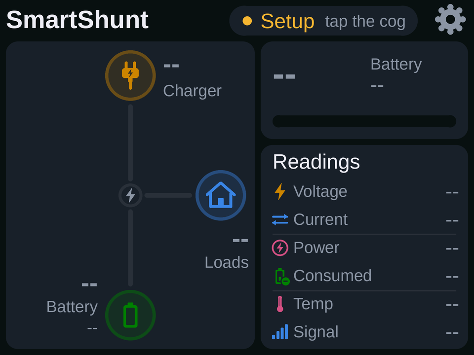<br><sub>First start: waiting for set-up</sub></td>
    <td></td>
  </tr>
</table>

### Settings

<table>
  <tr>
    <td align="center">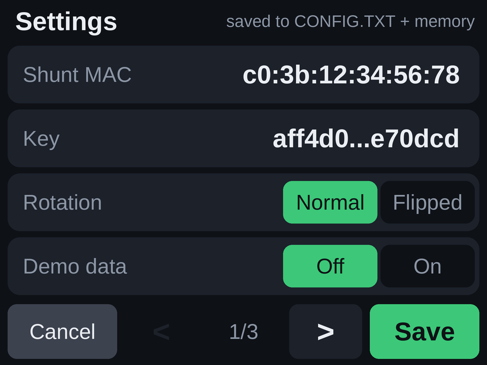<br><sub>Page 1: shunt, rotation, demo</sub></td>
    <td align="center">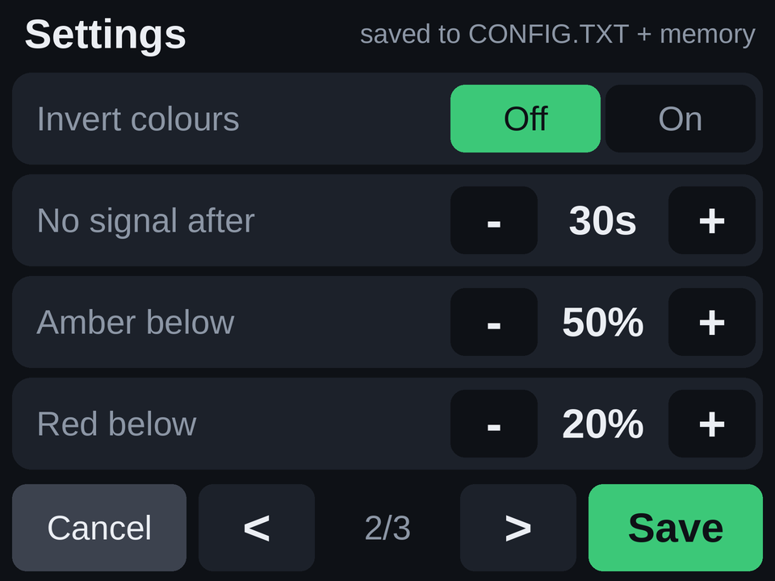<br><sub>Page 2: colours and thresholds</sub></td>
  </tr>
  <tr>
    <td align="center">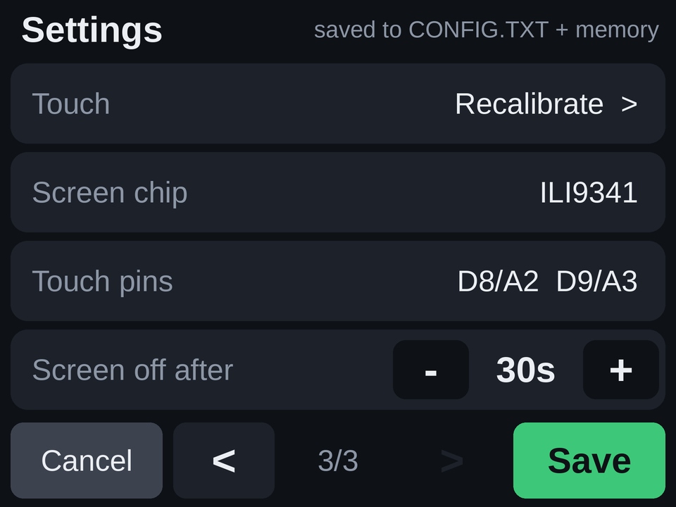<br><sub>Page 3: touch, hardware, screen timeout</sub></td>
    <td align="center">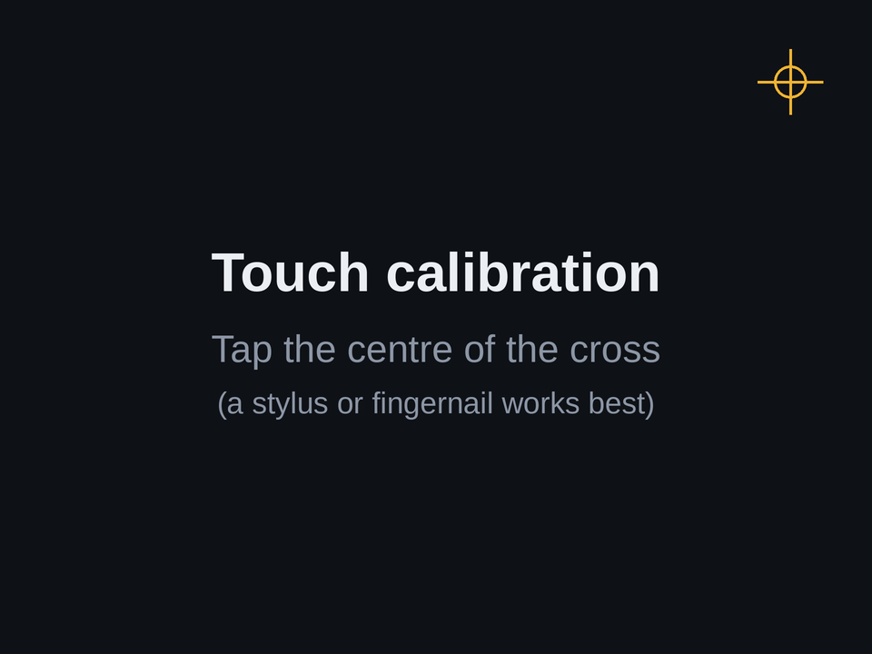<br><sub>Touch calibration</sub></td>
  </tr>
  <tr>
    <td align="center">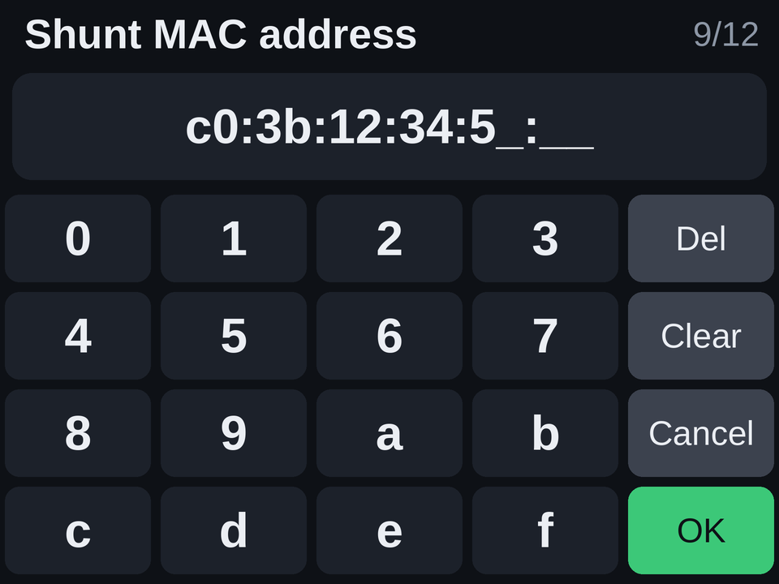<br><sub>Entering the MAC address</sub></td>
    <td align="center">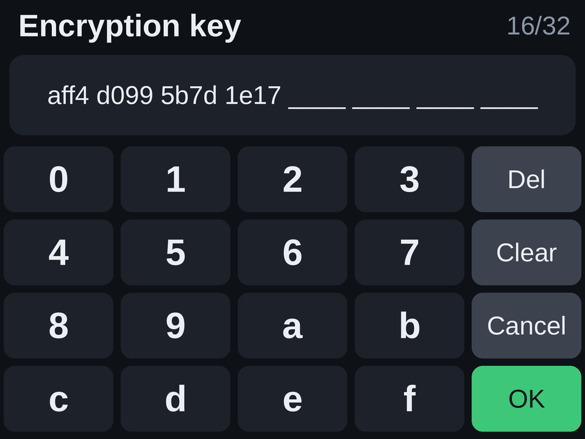<br><sub>Entering the encryption key</sub></td>
  </tr>
</table>

> These images are high-resolution renders (3×) of the sketch's screens: the same positions, colours, font and text, drawn smoothly so they're easy to read here. The real 320×240 panel shows exactly these layouts, at its own resolution.

## Hardware

| Part | Notes |
|---|---|
| **Victron SmartShunt** | Any SmartShunt (or BMV-712) with Bluetooth. |
| **Arduino UNO R4 WiFi** | Must be the **WiFi** version: Bluetooth runs on its ESP32-S3 radio chip. The R4 Minima has no Bluetooth. |
| **Jaycar XC4630** 2.8" TFT touch shield | 320×240, plugs straight on top of the R4. Other "MCUFriend-style" 2.4"/2.8" shields with an ILI9341 or UC8230 chip should work too. |
| microSD card *(optional)* | FAT32, 32 GB or smaller. Only needed if you want to edit settings on a computer. |

There's no wiring: the shield plugs straight onto the R4.

| Used by | Pins |
|---|---|
| Screen (8-bit parallel) | D2–D9 (data), A0 RD, A1 WR, A2 RS, A3 CS, A4 RESET |
| Touch panel (shared with the screen) | Found automatically at start-up; on the XC4630 it's D8/A2 and D9/A3 |
| SD card | D10–D13 (SPI) |

> The XC4630's backlight is wired permanently on; no pin controls it. The screen timeout therefore blanks the screen to black rather than switching the light off.

### Mounting the screen away from the board

The shield doesn't have to sit on the R4. You can mount the screen on a wall, say, with the R4 behind it, and run wires between them. Leave the SD card out: its pins (D10–D13) don't need wiring, and settings are kept in the R4's built-in memory.

**15 wires are needed:**

| R4 pin | Screen pin | |
|---|---|---|
| D8, D9, D2, D3, D4, D5, D6, D7 | LCD_D0 … LCD_D7 | Data, 8 wires (in this order) |
| A0 | LCD_RD | Read: used at start-up to identify the screen chip |
| A1 | LCD_WR | Write strobe: the most sensitive wire |
| A2 | LCD_RS | Command / data |
| A3 | LCD_CS | Chip select |
| A4 | LCD_RST | Reset |
| 5V | 5V | Power |
| GND | GND | Ground (the more ground wires the better, see below) |

The touch panel needs no extra wires: it shares D8, D9, A2 and A3 with the screen. D0, D1, A5 and D10–D13 aren't needed.


**Tips for the cable:**

- **Keep it short.** This is a fast 8-bit parallel bus. Up to about 30 cm is usually fine; much longer risks corrupted pixels or a white screen.
- **Use ribbon cable and fill the spare wires with ground.** A 20-way ribbon has room for the 15 wires plus five extra grounds. If you can, put a ground on each side of WR (A1).
- **If you see glitches** (random pixels, wrong colours, an occasional white screen), raise `R4BUS_WR_HOLD` in `Arduino_R4PAR8.h`, for example from 4 to 10. Each write gets slightly slower, which you won't notice.
- **Recalibrate the touch panel** once it's mounted (hold the screen while powering on). Longer wires shift the touch readings slightly.
- **Bluetooth range:** the R4's antenna is on the board, so it's behind the wall too. Check the signal strength in the Status box: −80 dBm or better is fine; below −90 dBm you'll get dropouts.

## How it works

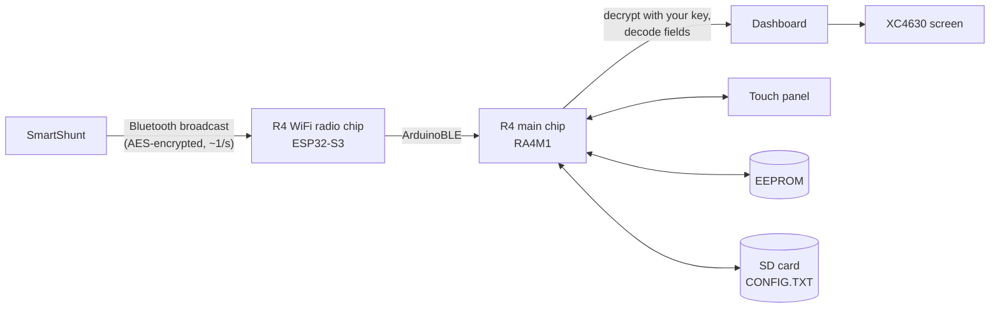
```mermaid
flowchart LR
    S[SmartShunt] -- "Bluetooth broadcast<br/>(AES-encrypted, ~1/s)" --> R[R4 WiFi radio chip<br/>ESP32-S3]
    R -- "ArduinoBLE" --> M[R4 main chip<br/>RA4M1]
    M -- "decrypt with your key,<br/>decode fields" --> D[Dashboard]
    M <--> T[Touch panel]
    M <--> E[(EEPROM)]
    M <--> C[(SD card<br/>CONFIG.TXT)]
    D --> L[XC4630 screen]
```

1. The SmartShunt broadcasts an encrypted *Instant Readout* packet about once a second.
2. The R4 listens for Bluetooth broadcasts and keeps only those from your shunt's MAC address.
3. Each packet is decrypted with your shunt's key (AES-128 in counter mode) and decoded into readings.
4. The dashboard redraws only the values that changed.

## Getting started

### 1. Install the Arduino libraries

In the Arduino IDE, install **Arduino UNO R4 Boards** under Tools → Board → Boards Manager. Then install these under Tools → Manage Libraries:

| Library | Author |
|---|---|
| **ArduinoBLE** | Arduino |
| **GFX Library for Arduino** | Moon On Our Nation |
| **SD** | Arduino (usually pre-installed) |

EEPROM comes with the R4 board package. The fonts are built into the sketch, so nothing is loaded from the SD card at run time.

### 2. Upload the sketch

Open `ShuntDisplayR4/ShuntDisplayR4.ino`, select **Arduino UNO R4 WiFi** under Tools → Board, and upload. All the files in the `ShuntDisplayR4` folder must stay together.

This is the only time you need the Arduino IDE. After this, everything is changed on the screen.

### 3. First start: calibrate the touch panel

On first start the status pill says **Setup / tap the cog**. Tap anywhere on the screen, then tap the centre of each of the three crosses. A fingernail or stylus is more accurate than a fingertip. The calibration is saved, and you won't be asked again.

### 4. Enter your shunt's details

Tap the **cog**, then on page 1:

1. Tap **Shunt MAC** and type the 12 characters ([where to find them](#before-you-start-your-shunts-mac-address-and-key)). The colons are added for you.
2. Tap **Key** and type the 32 characters.
3. Tap **Save**.

Within a few seconds the dashboard should fill in, and the status pill should show **OK**.

> Want to check the screen before you have the shunt handy? Turn on **Demo data** on page 1 for moving fake readings.

## Using the display

| To… | Do this |
|---|---|
| Open settings | Tap the **cog** in the top-right corner |
| Wake the screen | Tap anywhere (that tap only wakes it) |
| Recalibrate touch | Settings page 3 → **Recalibrate**, or hold the screen while powering on |
| Add an extra charger | Settings page 4: tap **Charger 1 MAC** and **Charger 1 key** |
| Remove an extra charger | Settings page 4: tap its MAC, then **Clear** and **OK** |
| Leave settings without changes | **Cancel**, or leave it untouched for 90 seconds |

**Save** applies the new settings straight away, with no restart.

### Where settings are stored

Settings are always saved in the R4's **built-in EEPROM**, so they survive power-off with or without an SD card. If an SD card is fitted, they're also written to **`CONFIG.TXT`**:

| At start-up | What happens |
|---|---|
| Card with `CONFIG.TXT` | The file is used, and copied into the built-in memory. Edit the file on a computer to change settings. |
| Blank card | `CONFIG.TXT` is written from the current settings. |
| No card | The built-in memory is used, or the defaults if nothing has been saved yet. |

## Settings reference

All settings can be changed on the touch screen, except `lcd_chip`, which is only in `CONFIG.TXT` and rarely needed.

| On screen | `CONFIG.TXT` | Default | Meaning |
|---|---|---|---|
| Shunt MAC | `mac` | – | Your shunt's Bluetooth address. Colons optional: `c03b12345678` or `c0:3b:12:34:56:78`. |
| Key | `key` | – | The 32-character Instant Readout encryption key. |
| Rotation | `rotation` | `1` | `1` = landscape, `3` = landscape upside down. |
| Demo data | `demo` | `0` | `1` shows moving fake readings, for testing. |
| Invert colours | `invert` | `0` | `1` if the colours look inverted (light background). |
| No signal after | `stale_after` | `30` | Seconds without data before showing "No signal". |
| Amber below | `soc_amber` | `50` | State of charge (%) below which the number turns amber. |
| Red below | `soc_red` | `20` | State of charge (%) below which it turns red. |
| Screen off after | `screen_off` | `30` | Seconds without a touch before the screen goes black. `0` = always on. |
| Recalibrate | `touch_cal` | – | Written by the calibration. Delete the line to force a new calibration. |
| Charger 1 / 2 MAC | `charger1_mac`, `charger2_mac` | – | An extra Victron charger's Bluetooth address ([extra chargers](#extra-victron-chargers)). Blank = not used. |
| Charger 1 / 2 key | `charger1_key`, `charger2_key` | – | That charger's Instant Readout key. |
| Loads icon | `loads_icon` | `house` | The picture on the Loads node: `house`, `caravan` or `boat`. |
| Other charging | `other_source` | `auto` | Name and icon for charging the extra chargers don't account for: `auto`, `dcdc`, `solar`, `mains` or `alternator`. |
| *(file only)* | `lcd_chip` | `9341` | Screen chip to use **only if it can't be detected**: `9341` for current XC4630 shields, `8230` for older batches. |

Example `CONFIG.TXT`:

```ini
# SmartShunt display settings
mac = c0:3b:12:34:56:78
key = <your 32-character key>
demo = 0
rotation = 1
lcd_chip = 9341
invert = 0
stale_after = 30
soc_amber = 50
soc_red = 20
screen_off = 30
# optional: an extra Victron charger
charger1_mac = c0:ff:ee:12:34:56
charger1_key = <its 32-character key>
other_source = dcdc
loads_icon = caravan
```

Lines starting with `#` are ignored, and upper or lower case is fine. Windows or Unix line endings both work.

## Status messages

The status pill at the top of the dashboard:

| Status | Detail line | Meaning |
|---|---|---|
| **OK** (green) | `3s ago` | Receiving data: time since the last packet. The signal strength is in the Readings card. |
| **Searching** (amber) | – | Bluetooth is running, but the shunt hasn't been heard yet. |
| **No signal** (amber) | `45s ago` | Nothing heard for longer than *No signal after*. Values turn grey. |
| **ALARM** (red) | alarm name | The shunt is reporting an alarm. The screen also wakes up. |
| **Bad key** (red) | `check key` | Packets from your shunt are arriving, but the key doesn't match. |
| **Setup** (amber) | `tap the cog` | The MAC address or key hasn't been entered yet. |
| **BLE fail** (red) | `retrying...` | Bluetooth didn't start. The display restarts the radio chip and retries every 15 s. |

Signal strength guide: −60 dBm is strong, −80 dBm is fine, and below −90 dBm you'll see dropouts.

## Troubleshooting

Open **Tools → Serial Monitor** at **115200** baud and press the R4's reset button. The display prints where its settings came from, the touch pins it found, its calibration, and what happens on each tap.

<details>
<summary><b>The screen is all white</b></summary>

The screen isn't receiving commands. Check the Serial Monitor: it prints the screen chip's ID and which driver it chose. If the chip couldn't be detected, set `lcd_chip` in `CONFIG.TXT` (`9341` or `8230`). If that doesn't help, press the shield firmly onto the headers, then try raising `R4BUS_WR_HOLD` in `Arduino_R4PAR8.h` (for example to 10), which gives slower panels more time to register each byte.
</details>

<details>
<summary><b>A screen on extension wires goes white</b></summary>

Check that **RESET (A4)** is wired: a floating reset pin lets the screen work for a while and then go white for good. If it is, check every wire from end to end with a multimeter, especially WR (A1), CS (A3), 5V and GND, and wiggle the wires while you measure. The Serial Monitor shows the screen chip ID at start-up: `D3= 0 93 41` (or similar) means the screen answered; anything else means it didn't. If all the wires are good, the cable may be too long: see [Mounting the screen away from the board](#mounting-the-screen-away-from-the-board).
</details>

<details>
<summary><b>Tapping does nothing</b></summary>

Check the Serial Monitor at start-up. "Touch panel on D8/A2 and D9/A3" (or similar) means it was found; "Touch panel not found" means the shield's touch pins didn't respond, and settings can then only be changed in `CONFIG.TXT`. If taps register but land in the wrong place, recalibrate: hold the screen while powering on.
</details>

<details>
<summary><b>"BLE fail"</b></summary>

On the R4 WiFi, Bluetooth runs on a separate radio chip. After the reset button or an upload, the radio can be left in a state where Bluetooth won't restart. The display handles this by restarting the radio chip once, then retrying every 15 s. Touch keeps working meanwhile. If it never clears, unplug the R4 for a few seconds. If that doesn't help, update the radio firmware: IDE → Tools → Firmware Updater.
</details>

<details>
<summary><b>"Bad key" or "No signal"</b></summary>

- **Bad key:** the shunt is being heard but the key is wrong. Re-enter it from VictronConnect.
- **No signal:** check the MAC address, and that *Instant readout via Bluetooth* is still on. A shunt firmware update can turn it off. Also check the distance: through walls, Bluetooth range is only a few metres.
</details>

<details>
<summary><b>Settings don't seem to apply</b></summary>

If there's an SD card, `CONFIG.TXT` always wins at start-up, so an old file on the card will override settings changed without the card. "config error" in the status pill means a line in `CONFIG.TXT` wasn't understood; the Serial Monitor shows how many.
</details>

<a id="technical-notes-arduino"></a>
## Technical notes

<details>
<summary><b>Why a custom screen bus</b></summary>

GFX Library for Arduino includes an UNO R4 parallel bus, but its write pulse is only about 40 ns on the R4 WiFi, which is marginal for some panels. `Arduino_R4PAR8.h` writes the same pins directly through the port registers, with a longer write pulse, adjustable via `R4BUS_WR_HOLD`.
</details>

<details>
<summary><b>ILI9341 vs UC8230</b></summary>

Jaycar's documentation says the XC4630 uses a UC8230, but current shields read back as an ILI9341. At start-up the sketch reads the chip's ID (UC8230: register `0x0000` = `0x8230`; ILI9341: command `0xD3` returns `93 41`) and picks the driver; `lcd_chip` is only a fallback. The ILI9341 driver comes from GFX Library for Arduino. `Arduino_UC8230.h` is a driver for the older chip, ported from the start-up sequence and orientation handling in MCUFRIEND_kbv. Touch calibrations remember which chip they were made on, so swapping to the other kind of shield asks for a fresh calibration.
</details>

<details>
<summary><b>Touch panel</b></summary>

The 4-wire resistive touch panel shares four pins with the screen, and which four varies between shields. At start-up each digital pin is pulled low while each analog pin is pulled up; a pair that follows is joined through a touch layer. Presses are detected by grounding one layer and pulling up the other. Positions are read as voltage dividers, taking the median of 5 samples. Calibration uses three taps and works out which raw axis maps to which screen axis. If the rotation is flipped later, the mapping is flipped to match.
</details>

<details>
<summary><b>Bluetooth recovery on the R4 WiFi</b></summary>

ArduinoBLE on the R4 WiFi drives the ESP32-S3's Bluetooth stack through AT commands. If only the main chip restarts, as with the reset button or an upload, the radio's stack is still running and `BLE.begin()` fails. The sketch then sends the radio firmware's `AT+RESET`, waits for it to boot, and tries again. The loop never blocks, so touch and the screen keep working.
</details>

<details>
<summary><b>Memory use</b></summary>

About 173 KB of the RA4M1's 256 KB flash (most of it Bluetooth and fonts), and about 11 KB of its 32 KB RAM statically. A 182×30 off-screen buffer (~10.9 KB) is used to draw each changing value before copying it to the screen, which is what keeps the updates flicker-free.
</details>

---

# Raspberry Pi display

The same dashboard on a Raspberry Pi with any HDMI or DSI touch screen. It starts at boot, runs full screen, and is set up entirely on the screen. Full details are in its own [README](ShuntDisplayPi/README.md).

## Pi features

- **The same power-flow dashboard** as the other versions, laid out for landscape or portrait. The layout scales to any resolution, and the display can be rotated 0°, 90°, 180° or 270°.
- **Extra Victron chargers (optional):** up to two, found with **Find nearby** ([details](#extra-victron-chargers)).
- **Touch set-up:** tap the cog. A hex keypad for the MAC address and key, a **Find nearby** list of the battery monitors in range, and lists and steppers for everything else.
- **Screen timeout that switches the backlight off** on screens that allow it (such as the official Raspberry Pi touch displays), and a **brightness** setting. Other screens blank to black. A tap wakes it, and so does an alarm.
- **Dark and light themes** and **45 languages** (the Android app's translations), with fonts for every script.
- **Settings on the SD card:** on a dedicated display the settings file is on the boot partition, so it can be edited on a PC, just like the Arduino display's SD card.
- **Recovers by itself:** switches Bluetooth back on if it's off, and restarts the scan if it stalls.

## Pi screens

<table>
  <tr>
    <td align="center">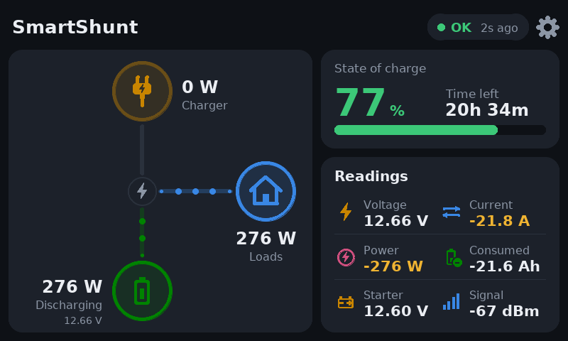<br><sub>Dashboard, 800×480</sub></td>
    <td align="center">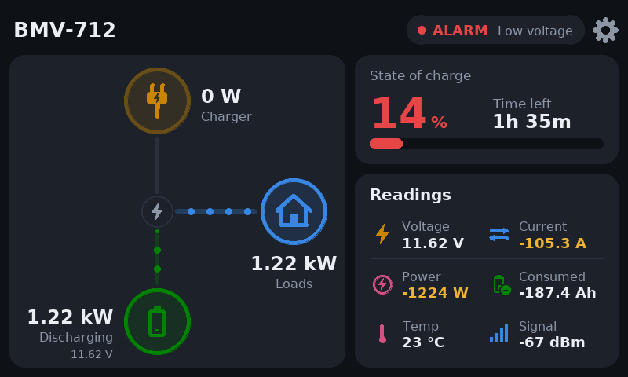<br><sub>An alarm, shown by name</sub></td>
  </tr>
  <tr>
    <td align="center">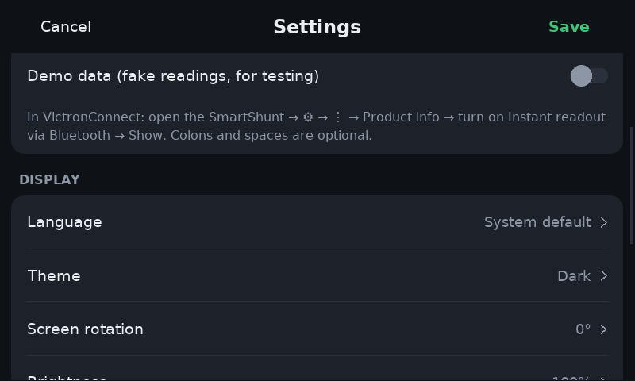<br><sub>Settings</sub></td>
    <td align="center">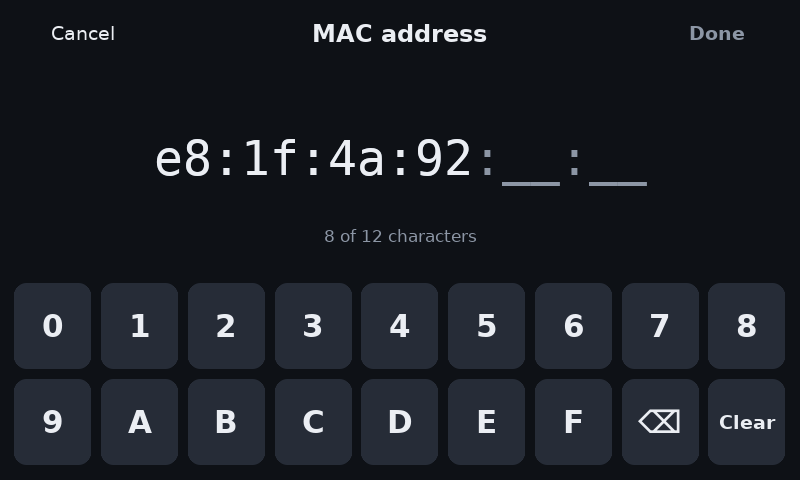<br><sub>Entering the MAC address</sub></td>
  </tr>
  <tr>
    <td align="center">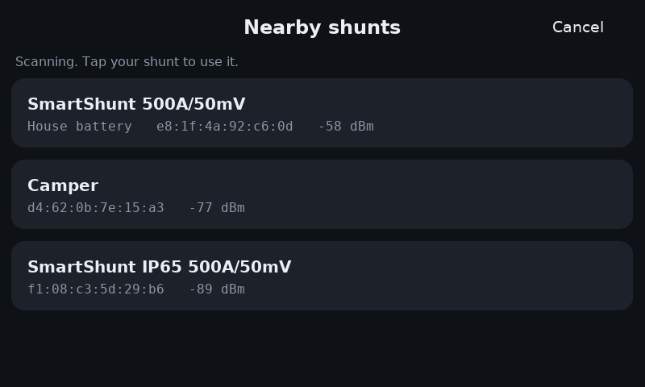<br><sub>Find nearby</sub></td>
    <td align="center">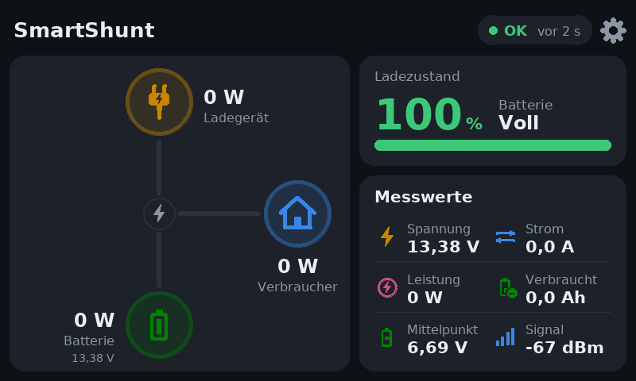<br><sub>In German (Deutsch)</sub></td>
  </tr>
</table>

> These images are drawn by the Pi app itself, rendered off-screen at 800×480.

## What you need

- **A Raspberry Pi with Bluetooth:** Pi 3, 3B+, 4, 5, 400, 500, Zero W or Zero 2 W. Other models work with a USB Bluetooth adapter.
- **A touch screen:** HDMI or DSI, any resolution. A plain monitor with a mouse also works.
- **Raspberry Pi OS** Bookworm or newer. The Lite version is best for a dedicated display.

## Installing on the Pi

```bash
sudo apt install -y git
git clone https://github.com/DnG-Crafts/SmartShunt-Display.git
cd SmartShunt-Display/ShuntDisplayPi
sudo bash install.sh
sudo reboot
```

The installer adds pygame, bleak and the fonts, copies the app to `/opt/shunt-display` and starts it full screen at every boot. If the Pi starts the desktop, it offers to switch to the console, because the desktop would take over the screen. To run it inside the desktop instead, use `sudo bash install.sh --desktop`.

To try it without installing: `python3 shunt_display.py --demo --window 800x480`.

Then tap the cog, use **Find nearby** or type the MAC address, type the key, and tap **Save** ([where to find them](#before-you-start-your-shunts-mac-address-and-key)).

## Pi settings

| Setting | In the file | Meaning |
|---|---|---|
| MAC address, Encryption key, Demo data | `mac`, `key`, `demo` | As on the other versions. |
| Language | `language` | Blank follows the system language, or a code such as `de`, `ja`, `zh-TW`. |
| Theme | `theme` | `2` dark, `1` light. |
| Screen rotation | `screen_rotation` | `0`, `90`, `180` or `270`. |
| Brightness | `brightness` | 10–100 %, when the backlight can be controlled. |
| Screen off after | `screen_off` | Seconds without a touch; `0` = never. |
| "No signal" after, charge amber/red below | `stale_after`, `soc_amber`, `soc_red` | As on the other versions. |

The file is `/boot/firmware/shunt-display.txt` on a dedicated display, or `~/.config/shunt-display/CONFIG.TXT` when run from the desktop.

---

# Android app

The same dashboard on an Android phone or tablet. Install it from Google Play, or build it yourself from the source below.

<p><a href="https://play.google.com/store/apps/details?id=dngsoftware.shuntdisplay"></a></p>

It's a plain-Java app with no third-party libraries, package name `dngsoftware.shuntdisplay`. Full details are in the app's own [README](ShuntDisplayAndroid/README.md).

## App features

- **The same power-flow dashboard** as the Arduino display, in a layout that suits portrait or landscape.
- **Extra Victron chargers (optional):** up to two, found with **Find nearby**; the key can be picked up from the clipboard too ([details](#extra-victron-chargers)).
- **Find nearby:** lists the Victron battery monitors in range by model and signal strength. Tap yours instead of typing the MAC address.
- **Clipboard detection:** copy the key in VictronConnect, switch back, and tap **Use** on the banner that appears.
- **Full screen:** hides the status and navigation bars, and uses the space around a notch. Optional keep-awake.
- **Dark and light themes**, or follow the phone.
- **45 languages**, with a language setting of its own ([list](#languages)).
- **Alarms by name**, such as "Low voltage" or "High temperature", rather than a code.
- **Tablet friendly:** the settings and Find nearby screens stay a readable width on large screens.
- **Private:** no internet permission, no ads, no analytics. Scanning stops when the app isn't on screen.

## App screens

<table>
  <tr>
    <td align="center"><br><sub>Dark theme</sub></td>
    <td align="center">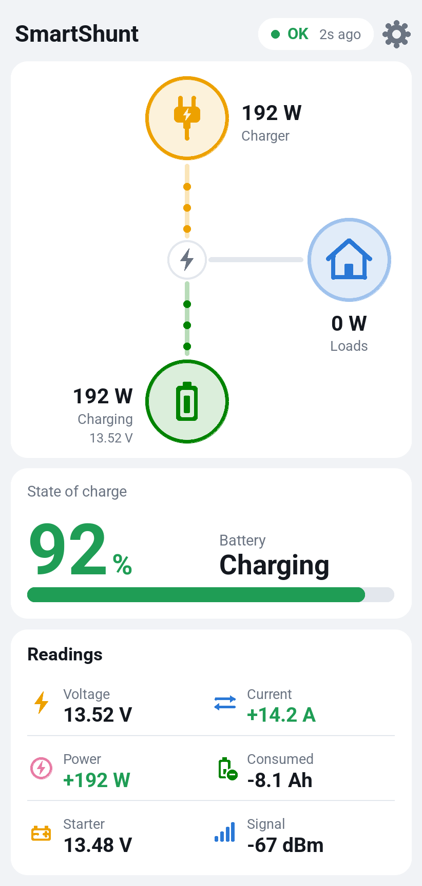<br><sub>Light theme</sub></td>
    <td align="center">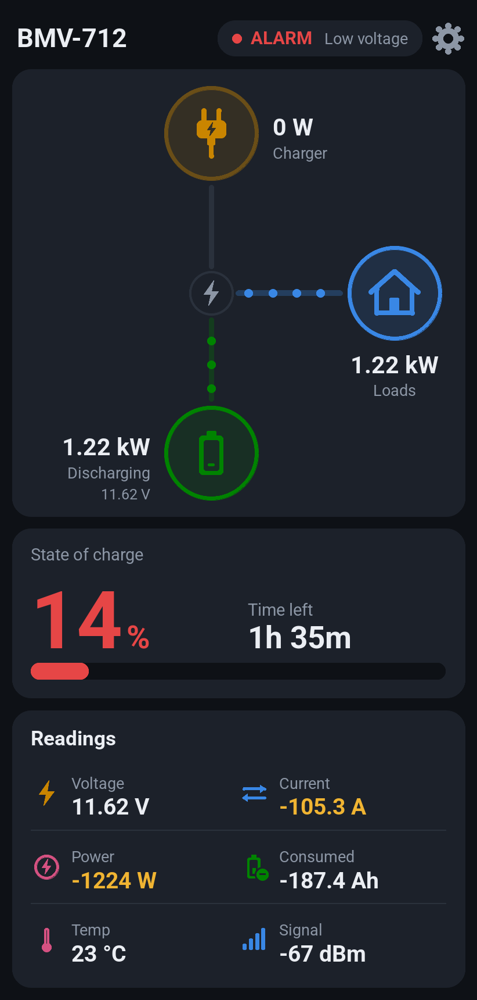<br><sub>An alarm, shown by name</sub></td>
  </tr>
</table>

<p align="center">
  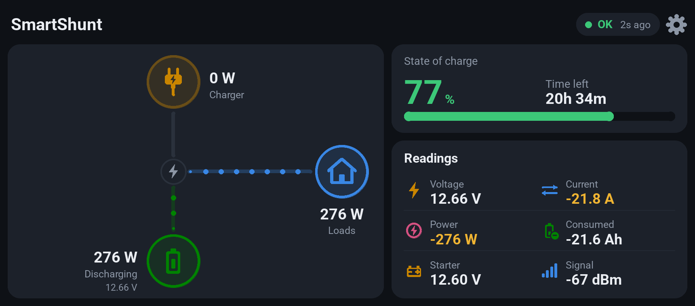
</p>


> These images are rendered from the app's own layout code and colours, not captured on a phone.

## Building the app

You only need this if you want to change the app; otherwise [install it from Google Play](https://play.google.com/store/apps/details?id=dngsoftware.shuntdisplay). You need **Android Studio** with support for **Android Gradle Plugin 9.3** (Gradle 9.5, JDK 17+). The build files are Groovy (`build.gradle`).

1. In Android Studio choose **File → Open** and pick the `ShuntDisplayAndroid` folder (not the repository root).
2. Let Gradle sync. The first sync downloads Gradle and the Android plugin.
3. Plug in your phone with USB debugging on, and press **Run ▶**.

From the command line, inside `ShuntDisplayAndroid`: `./gradlew assembleDebug` builds `app/build/outputs/apk/debug/app-debug.apk`, and `./gradlew test` runs the unit tests (the decoder's test vectors and the `CONFIG.TXT` format).

The app runs on **Android 8.0 (API 26) or newer**, with Bluetooth LE.

## First run

1. The status pill says **Setup / tap the cog**. Tap the **cog** (top right).
2. Tap **Find nearby** and choose your shunt, or type its MAC address.
3. Enter the **encryption key**: copy it in VictronConnect, come back to the app and tap **Use** on the banner (or tap **Paste**, or type it).
4. Tap **Save**. Allow **Nearby devices** when Android asks (on Android 11 and older it asks for Location instead).

## App settings

| Setting | Meaning | In `CONFIG.TXT` |
|---|---|---|
| MAC address | Your shunt. Colons optional. | `mac` |
| Encryption key | 32 hex characters. | `key` |
| Demo data | Moving fake readings, for testing. | `demo` |
| Language | System default, or any of the 45 languages. | phone only |
| Theme | System, Light or Dark. | phone only |
| Orientation | Automatic, Portrait, Landscape or Landscape (flipped). | phone only |
| Full screen | Hides the status and navigation bars on the dashboard. On by default. | phone only |
| Keep the phone awake | Stops the phone sleeping while the app is open. | phone only |
| "No signal" after | Seconds without data before values turn grey. | `stale_after` |
| Charge amber / red below | State-of-charge colour thresholds. | `soc_amber`, `soc_red` |

## App status messages

The app uses the same status words as the Arduino display (**OK**, **Searching**, **No signal**, **ALARM**, **Bad key**, **Setup**, **BLE fail**), plus a few for the phone. Tap the status pill to fix most of them.

| Status | Meaning |
|---|---|
| **Permission** | Tap to allow Nearby devices (or Location on Android 11 and older). |
| **Bluetooth off** | Tap to turn Bluetooth on. |
| **Location off** | Android 11 and older only: Location must be on for any Bluetooth scan. Tap to open the setting. |
| **No BLE** | The phone doesn't have Bluetooth LE. |

The app only scans while it's on screen. The scan is filtered to your shunt's address, which Android allows to run indefinitely, and it restarts itself if the shunt goes quiet for a minute.

## Languages

English, Español, Français, Deutsch, Português, Italiano, 日本語, 한국어, 简体中文, 繁體中文, Русский, Nederlands, Polski, Türkçe, Svenska, हिन्दी, Українська, Tiếng Việt, ไทย, Bahasa Indonesia, Čeština, Ελληνικά, Magyar, Română, Dansk, Norsk bokmål, Suomi, বাংলা, Slovenčina, Filipino, Bahasa Melayu, Български, Hrvatski, Српски, Català, Lietuvių, Latviešu, Eesti, Slovenščina, ქართული, Հայերեն, Монгол, Kiswahili, தமிழ் and తెలుగు.

The app follows the phone's language, or you can pick one under **Settings → Display → Language**. On Android 13 and newer it's also in the phone's **Settings → Apps → Shunt Display → Language**. Readings use your language's decimal separator (12,66 V).

The translations haven't been reviewed by native speakers yet, so corrections are welcome. They're in `ShuntDisplayAndroid/app/src/main/res/values-<language>/strings.xml`.

---

# T-Dongle-S3 display

A small, basic readout on a [LILYGO T-Dongle-S3](https://lilygo.cc/products/t-dongle-s3): an ESP32-S3 USB dongle with a 0.96" 160×80 screen and a microSD slot. Plug it into any USB port or charger. It shows the state of charge, time left, voltage, current, power and consumed Ah, and a second page (press its button) with the aux input, signal and model. The RGB LED glows the charge colour. It's set up from a PC: put your shunt's MAC address and key in `CONFIG.TXT` on its SD card. Full details are in its own [README](ShuntDisplayDongle/README.md).

<p align="center">
  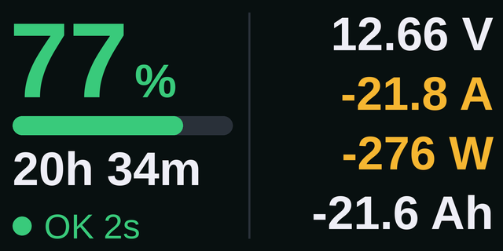
  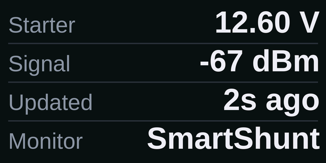
</p>

---

# Sharing settings

All three versions use the same `CONFIG.TXT` format.

- **Export CONFIG.TXT** in the app writes a file you can copy to the display's SD card. Restart the display to load it.
- **Import CONFIG.TXT** reads the display's file into the app. Tap **Save** to keep the settings.

The shared settings are `mac`, `key`, `demo`, `stale_after`, `soc_amber`, `soc_red`, and the extra chargers' `charger1_mac`, `charger1_key`, `charger2_mac`, `charger2_key` and `other_source`, and the Loads icon (`loads_icon`). The Arduino-only lines (`rotation`, `lcd_chip`, `invert`, `touch_cal`, and `screen_off` for the app) aren't used by the others, but they're kept, so a round trip doesn't lose the display's touch calibration.

- **Raspberry Pi:** its settings file is also a `CONFIG.TXT`-style file: on a dedicated display it's `shunt-display.txt` on the SD card's boot partition. An Arduino `CONFIG.TXT` (or an export from the app) can be copied in as it is. Going the other way, delete the Pi-only lines (`theme`, `language`, `screen_rotation`, `brightness`) first, or the Arduino display shows "config error".

---

# Victron Instant Readout format

All three versions decode the same broadcast. The shunt sends manufacturer data under Victron's company ID `0x02E1`:

| Bytes | Content |
|---|---|
| 0–1 | record prefix (`0x10`, …) |
| 2–3 | model ID (for example `0xA389` = SmartShunt 500A/50mV) |
| 4 | record type (`0x02` = battery monitor; chargers: `0x08` AC charger, `0x01` solar charger, `0x0F` Orion XS) |
| 5–6 | IV / counter (little-endian) |
| 7 | first byte of the key: a quick check that the right key is set |
| 8… | encrypted payload |

The payload is AES-128-CTR encrypted, with the IV as a little-endian counter. Decrypted, it's a little-endian bit stream: remaining time (16 bits, minutes), voltage (16, 10 mV), alarm (16), aux value (16), aux mode (2), current (22, signed mA), consumed Ah (20, 0.1 Ah) and SOC (10, 0.1 %). All-ones means "not available".

The chargers' payloads start with the operation mode (8 bits: 0 off, 3 bulk, 4 absorption, 5 float, 6 storage…) and the charger error (8). Then an AC charger sends up to three outputs as volts (13 bits, 10 mV) and amps (11 bits, 0.1 A), then temperature and AC current; a solar charger sends battery volts (16, signed, 10 mV), amps (16, signed, 0.1 A), today's yield and PV watts; an Orion XS sends output volts (16, 10 mV) and amps (16, 0.1 A), then its input. The Orion XS layout isn't in Victron's published document; it's as decoded by the victron-ble and esphome-victron_ble projects.

The Arduino decoder (`ShuntDisplayR4/victron.h`) and the Raspberry Pi decoder (`ShuntDisplayPi/shuntdisplay/victron.py`) have their own AES; the Android decoder (`VictronDecoder.java`) uses the phone's. All three are checked against the test vectors of the victron-ble project, including captured packets from a Blue Smart IP22 and an MPPT.

---

# Repository layout

```
├── ShuntDisplayR4/                 Arduino sketch (UNO R4 WiFi + XC4630)
│   ├── ShuntDisplayR4.ino          main program: Bluetooth, what the dashboard shows, screen timeout
│   ├── dashboard.h                 the dashboard: flow picture, charge card, readings
│   ├── colors.h                    the colour palette
│   ├── ui.h                        touch input, calibration, settings pages, keypad
│   ├── config.h                    settings: CONFIG.TXT parser/writer, EEPROM storage
│   ├── victron.h                   Victron Instant Readout decoder (shunt and chargers) + AES-128
│   ├── Arduino_R4PAR8.h            8-bit parallel screen bus for the R4
│   ├── Arduino_UC8230.h            driver for older XC4630 shields (UC8230 chip)
│   ├── fonts.h                     built-in fonts (Liberation Sans)
│   └── CONFIG.TXT                  example settings file for the SD card
├── ShuntDisplayPi/                 Raspberry Pi display (Python, pygame, bleak)
│   ├── shunt_display.py            start here
│   ├── install.sh                  installer: starts it at boot, full screen
│   ├── shuntdisplay/               the app, and its 45 languages in lang/
│   ├── tests/                      unit tests and off-screen UI tests
│   ├── docs/images/                screenshots
│   └── README.md                   the Pi version's full documentation
├── ShuntDisplayDongle/             LILYGO T-Dongle-S3 sketch (ESP32-S3, 160x80 screen)
├── ShuntDisplayAndroid/            Android Studio project (open this folder)
│   ├── app/src/main/java/…         the app's Java source
│   ├── app/src/main/res/           layouts, themes and the 45 languages
│   ├── app/src/test/…              unit tests
│   ├── docs/images/                app screenshots
│   └── README.md                   the app's full documentation
└── docs/images/                    Arduino display screenshots
```

---

# Credits

- **[victron-ble](https://github.com/keshavdv/victron-ble)** by keshavdv: the reference for the Instant Readout format and the source of the decoders' test vectors.
- **[GFX Library for Arduino](https://github.com/moononournation/Arduino_GFX)** by Moon On Our Nation: graphics, the ILI9341 driver, and canvases.
- **[MCUFRIEND_kbv](https://github.com/prenticedavid/MCUFRIEND_kbv)** by David Prentice: the UC8230 start-up sequence and orientation quirks.
- **[ArduinoBLE](https://github.com/arduino-libraries/ArduinoBLE)**, **SD** and **EEPROM** by Arduino.
- **Liberation Sans** fonts (SIL Open Font License), converted to bitmap fonts in `fonts.h`.
- **[pygame](https://www.pygame.org)** and **[bleak](https://github.com/hbldh/bleak)** for the Raspberry Pi version's screen and Bluetooth.

This project isn't affiliated with or endorsed by Victron Energy, Jaycar or Raspberry Pi Ltd. Victron, SmartShunt, BMV and VictronConnect are trademarks of Victron Energy B.V.

Google Play and the Google Play logo are trademarks of Google LLC.
