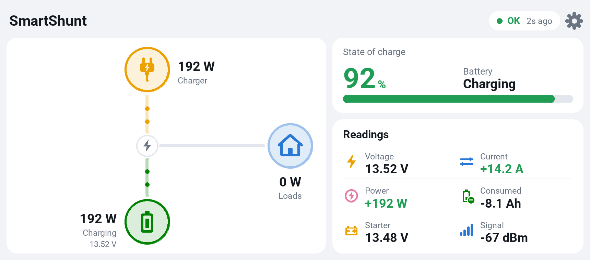
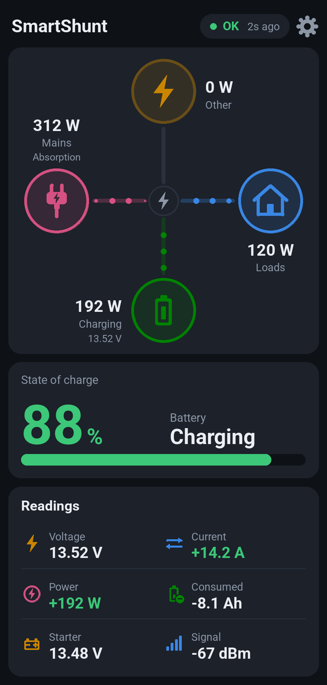
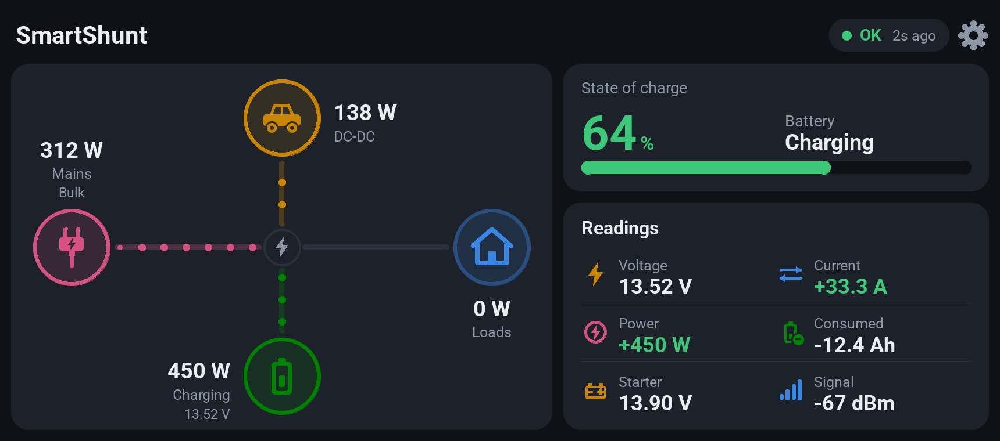

# Shunt Display for Android

The Android version of the SmartShunt display: live battery data from a **Victron SmartShunt** (or BMV-712), read over Bluetooth, on your phone or tablet. Same dashboard, settings and behaviour as the [Arduino display](../README.md#arduino-display), plus dark and light themes and 45 languages.

<p><a href="https://play.google.com/store/apps/details?id=dngsoftware.shuntdisplay"></a></p>

This folder is a complete Android Studio project. The [main README](../README.md) covers both the app and the Arduino display.

<p align="center">
  
  
  
</p>
<p align="center">
  
  
</p>
<p align="center">
  
  
</p>
<p align="center"><sub>With an extra Victron charger (a Blue Smart IP22) set up. Right: charging it can't account for, shown as DC-DC.</sub></p>

> The dashboard images are rendered from the app's own layout code and colours, not captured on a phone.

## Features

- **Power-flow dashboard:** a live picture of the charger, the battery and your loads, with dots moving along the line in the direction power is flowing. The shunt measures the battery only, so it can't tell mains from solar: there's one **Charger** input, which covers whatever is charging the battery.
- **Readings card:** voltage, current, power, consumed Ah, the aux input (starter voltage, midpoint or temperature) and signal strength, straight from the shunt. Nothing depends on the time of day, so no internet or clock is needed.
- **State of charge** big and colour-coded, with the time left while discharging.
- **Extra Victron chargers (optional):** add a Blue Smart IP22, SmartSolar MPPT or Orion XS (up to two) and each gets its own node with its output and charge stage. The loads are then worked out while charging too, and charging they don't account for (a non-Victron DC-DC charger, say) shows on its own node. See the [main README](../README.md#extra-victron-chargers).
- **No pairing:** it reads Victron's *Instant Readout* broadcasts, so it works alongside VictronConnect and the Arduino display at the same time.
- **Find nearby:** lists the Victron battery monitors in range by model and signal strength. Tap yours instead of typing the MAC address.
- **Clipboard detection:** copy the key (or MAC address) in VictronConnect, switch to the app's settings, and a banner offers it with a **Use** button. The clipboard is only read when something new has been copied, so Android 12+ doesn't keep showing its "pasted from your clipboard" message.
- **Themes:** dark (the Arduino display's colours), light, or follow the phone.
- **45 languages:** English plus Español, Français, Deutsch, Português, Italiano, 日本語, 한국어, 简体中文, 繁體中文, Русский, Nederlands, Polski, Türkçe, Svenska, हिन्दी, Українська, Tiếng Việt, ไทย, Bahasa Indonesia, Čeština, Ελληνικά, Magyar, Română, Dansk, Norsk bokmål, Suomi, বাংলা, Slovenčina, Filipino, Bahasa Melayu, Български, Hrvatski, Српски, Català, Lietuvių, Latviešu, Eesti, Slovenščina, ქართული, Հայերեն, Монгол, Kiswahili, தமிழ் and తెలుగు. It follows the phone's language, or you can pick one in Settings (on Android 13+ also under the phone's Settings → Apps → Shunt Display → Language). Readings use your language's decimal separator (12,66 V).
- **Layouts:** landscape puts the power-flow picture on the left with the charge and readings cards beside it, portrait stacks them, and the orientation can be locked. On a tablet, the settings and "Find nearby" screens stay a readable width instead of stretching edge to edge.
- **Colour-coded:** state of charge turns amber and red below levels you choose, and current and power are green while charging and amber while discharging.
- **Alarms by name:** "Low voltage", "High temperature" and so on, rather than a code.
- **Full screen:** the dashboard hides the status and navigation bars (swipe in from the edge to show them briefly) and uses the space around a notch. It can be switched off.
- **Keep awake (optional):** stops the phone sleeping while the dashboard is open; otherwise the phone's own screen timeout applies.
- **Shares settings with the Arduino display:** export a `CONFIG.TXT` for its SD card, or import one from it. Display-only lines, such as its touch calibration, are kept.
- **Plain Java, no libraries:** only the Android framework, so there are no dependency versions to keep up with.

## Requirements

- **Android 8.0 (API 26) or newer**, with Bluetooth LE.
- **Android Studio** with **Android Gradle Plugin 9.3** support (Gradle 9.5, JDK 17+). A newer Studio will offer to upgrade the plugin, which is safe to accept.

## Opening the project

1. Unzip, then in Android Studio choose **File → Open** and pick the `ShuntDisplayAndroid` folder.
2. Let Gradle sync. The first sync downloads Gradle and the Android plugin.
3. Plug in your phone with USB debugging on, and press **Run ▶**.

Or from the command line: `./gradlew assembleDebug` builds `app/build/outputs/apk/debug/app-debug.apk`, and `./gradlew test` runs the unit tests.

## First run

1. The status pill says **Setup / tap the cog**. Tap the **cog** (top right).
2. Tap **Find nearby** and choose your shunt, or type its MAC address.
3. Enter the **encryption key**. It comes from VictronConnect → SmartShunt → ⚙ → ⋮ → Product info → turn on *Instant readout via Bluetooth* → Show. Copy it there, come back to the app, and tap **Use** on the banner that appears (or tap **Paste**, or type it).
4. Tap **Save**. Allow **Nearby devices** when Android asks (on Android 11 and older it asks for Location instead).

## Settings

| Setting | Meaning | In `CONFIG.TXT` |
|---|---|---|
| MAC address | Your shunt. Colons optional. | `mac` |
| Encryption key | 32 hex characters. | `key` |
| Demo data | Moving fake readings, for testing. | `demo` |
| Chargers → Charger 1 / 2 | Extra Victron chargers (optional): MAC address (or **Find nearby**) and key, like the shunt. Clear both to remove one. | `charger1_mac`, `charger1_key`, `charger2_mac`, `charger2_key` |
| Other charge source | What to call charging the chargers don't account for: Automatic, DC-DC, Solar, Mains or Alternator. | `other_source` |
| Language | System default, or any of the 45 languages. | phone only |
| Theme | System, Light or Dark. | phone only |
| Loads icon | The picture on the Loads node: House, Caravan or Boat. | `loads_icon` |
| Orientation | Automatic, Portrait, Landscape or Landscape (flipped). | phone only |
| Full screen | Hides the status and navigation bars on the dashboard. On by default. | phone only |
| Keep the phone awake | Stops the phone sleeping while the app is open. | phone only |
| "No signal" after | Seconds without data before values turn grey. | `stale_after` |
| Charge amber / red below | State-of-charge colour thresholds. | `soc_amber`, `soc_red` |

**Export CONFIG.TXT** saves a file you can copy to the Arduino display's SD card. **Import CONFIG.TXT** reads one from it. The Arduino-only settings (`rotation`, `lcd_chip`, `invert`, `touch_cal`, `screen_off`) aren't used by the app, but are kept, so a round trip doesn't lose the display's touch calibration.

## Status messages

| Status | Meaning |
|---|---|
| **OK** | Receiving data; shows time since the last packet and signal strength. |
| **Searching** | Scanning, but nothing heard from your shunt yet. |
| **No signal** | Nothing heard for longer than the "No signal" setting. |
| **ALARM** | The shunt is reporting an alarm (named on the line below). |
| **Bad key** | Your shunt is heard but the key doesn't match. |
| **Setup** | MAC address or key not entered yet. Tap to open settings. |
| **Permission** | Tap to allow Nearby devices. |
| **Bluetooth off** / **Location off** | Tap to open the right system setting. |
| **BLE fail** | Android refused to start the scan (the error code is shown). |

## Good to know

- **Scanning only runs while the app is on screen.** It stops when you switch away, to save battery.
- **Android 12+:** the app declares that it never uses Bluetooth scans for location, so it doesn't need the Location permission there.
- **Android 11 and older:** Android requires the Location permission, and Location switched on, for any Bluetooth scan. The status pill tells you if it's off.
- **Long sessions:** the scan is filtered to your shunt's address, which Android allows to run indefinitely. If the shunt goes quiet for a minute, the scan restarts itself.

## Translations

The translations are in `app/src/main/res/values-<language>/strings.xml`, with English in `values/strings.xml`. They were machine-translated with care for the battery terms, but haven't been reviewed by native speakers yet, so corrections are welcome. To add a language, copy `values/strings.xml` into a new `values-<code>` folder, translate it, and add the language to `values/languages.xml` and `res/xml/locales_config.xml`.

## Project layout

```
app/src/main/java/dngsoftware/shuntdisplay/
├── MainActivity.java        dashboard screen: scanning, status, full screen, permissions
├── DashboardView.java       draws the dashboard (portrait and landscape)
├── SettingsActivity.java    settings screen, CONFIG.TXT import/export
├── DeviceScanActivity.java  "Find nearby": lists Victron battery monitors (or chargers) in range
├── ShuntScanner.java        Bluetooth LE scanning, permission and state checks
├── VictronDecoder.java      Instant Readout decryption (AES-128-CTR) and decoding, shunt and chargers
├── ShuntReading.java        one decoded reading from the shunt
├── ChargerReading.java      one decoded reading from a Victron charger
├── Settings.java            settings storage and the CONFIG.TXT format
├── Lang.java                the app language (per-app language on Android 13+)
└── Ui.java                  theme, orientation and edge-to-edge helpers
app/src/test/…               unit tests (decoder test vectors, CONFIG.TXT round trip)
```

## Google Play

The `playstore` folder has the store listing text, the policy form answers (`listing.md`), and the icon, feature graphic and screenshots for phones and 7- and 10-inch tablets. `PRIVACY.md` is the privacy policy to link from the listing.

## Credits

The Instant Readout format and the decoder's test vectors come from [victron-ble](https://github.com/keshavdv/victron-ble). This app isn't affiliated with or endorsed by Victron Energy. SmartShunt and VictronConnect are trademarks of Victron Energy B.V.

Google Play and the Google Play logo are trademarks of Google LLC.
