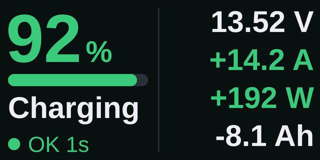
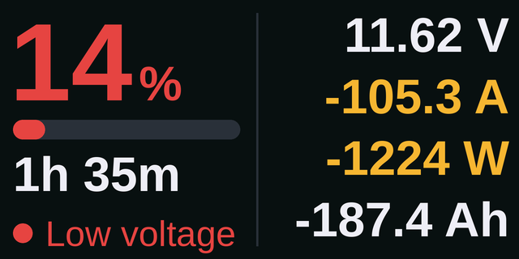

# Shunt Display for the LILYGO T-Dongle-S3

A basic battery readout from a **Victron SmartShunt** (or BMV-712) on the 0.96" screen of a [LILYGO T-Dongle-S3](https://lilygo.cc/products/t-dongle-s3). It reads the shunt's Bluetooth *Instant Readout* broadcasts, the same as the Arduino, Raspberry Pi and Android versions, so it works alongside them and VictronConnect. Plug it into any USB port or USB charger.

<p align="center">
  
  
</p>
<p align="center">
  
  
</p>

> The images are high-resolution renders (4×) of the 160×80 screen's layout.

## What it shows

- **Page 1:** state of charge (green, amber or red) with a bar, the time left (or Charging / Full), the status, and voltage, current, power and consumed Ah. Current and power are green while charging and amber while discharging.
- **Page 2:** the aux input (starter battery, midpoint or temperature), the signal strength, how long ago the last reading arrived, and the model.
- **The button** (BOOT, on the side) switches between the pages, and wakes the screen if it has turned off.
- **The RGB LED** glows the charge colour: green, amber or red (red also for an alarm). It's off while there's no data. `led = 0` turns it off.
- **Status:** OK (with the age of the last reading), Searching, No signal, Bad key, or the alarm by name (Low voltage, High temp…).

It's set up on a PC: there's no on-screen setup on a screen this small.

## What you need

- A **LILYGO T-Dongle-S3** with the screen (not the "no screen" version).
- A **microSD card** (FAT32, 32 GB or smaller), in the slot inside the dongle's USB plug.
- The shunt's **MAC address and key** from VictronConnect: open the SmartShunt → ⚙ → ⋮ → **Product info** → turn on **Instant readout via Bluetooth** → **Show**.

## Installing

1. **Arduino IDE:** install the **ESP32 core** by Espressif, version 3.x (Boards Manager → "esp32"), and the **GFX Library for Arduino** by Moon On Our Nation (Library Manager). Bluetooth, SD card and storage libraries come with the ESP32 core.
2. Open `ShuntDisplayDongle.ino` and pick these board settings (Tools menu):

   | Setting | Value |
   |---|---|
   | Board | **ESP32S3 Dev Module** |
   | USB CDC On Boot | Enabled (for the Serial Monitor) |
   | Flash Size | **16MB (128Mb)** |
   | Partition Scheme | **16M Flash (3MB APP/9.9MB FATFS)** (Bluetooth makes the sketch too big for the 1.2 MB default) |
   | PSRAM | Disabled |
   | USB Mode | Hardware CDC and JTAG |

3. Upload. If the upload fails, hold the **BOOT** button while plugging the dongle in, upload, then unplug and plug it in again.

## Setting it up

1. Put the microSD card in the dongle and plug it in. On a blank card it writes a `CONFIG.TXT` to fill in, and the screen says **Setup**.
2. Put the card in a PC, open `CONFIG.TXT`, and fill in `mac` and `key`. Colons in the MAC are optional.
3. Put the card back and plug the dongle in again. Within a few seconds the readings appear.

The settings are also copied into the dongle's own memory, so after that the card can be taken out. A card with a `CONFIG.TXT` on it always wins at start-up.

| Setting | Default | Meaning |
|---|---|---|
| `mac` | – | The shunt's Bluetooth address. |
| `key` | – | The 32-character Instant Readout key. |
| `demo` | `0` | `1` shows moving fake readings, to try the screen. |
| `stale_after` | `30` | Seconds without data before "No signal" (values turn grey). |
| `soc_amber`, `soc_red` | `50`, `20` | State of charge (%) below which it turns amber, then red. |
| `screen_off` | `0` | Seconds before the screen turns off; the button (or an alarm) wakes it. `0` = always on. |
| `brightness` | `100` | Screen brightness, 5–100 %. |
| `dongle_rotation` | `1` | `3` turns the picture upside down, for the way the dongle is plugged in. |
| `led` | `1` | `1` = the RGB LED shows the charge colour, `0` = off. |

It uses the same `CONFIG.TXT` format as the other versions, so their file can be copied across. Settings it doesn't use (the Arduino's touch calibration, the extra chargers and so on) are skipped. The Serial Monitor (115200) lists them.

## Troubleshooting

- **"Insert SD card":** the card wasn't found, and nothing has been saved yet. Check it's FAT32 and pushed all the way in.
- **"Setup":** `mac` or `key` in `CONFIG.TXT` is still the example, or missing.
- **"Bad key":** the shunt is heard, but the key doesn't match. Copy it again from VictronConnect.
- **"Searching" or "No signal":** check the MAC, and that Instant readout is still on in VictronConnect (a shunt firmware update can turn it off). The dongle's antenna is small, so keep it within a few metres of the shunt.
- **The picture is upside down:** set `dongle_rotation = 3`.
- **Colours look wrong or the picture is shifted:** the screen is set up for the T-Dongle-S3's 0.96" IPS panel (ST7735, 80×160 with a 26/1 pixel offset). Other dongles with a different screen need different numbers on the `Arduino_ST7735` line in `setup()`.

## Files

```
ShuntDisplayDongle/
├── ShuntDisplayDongle.ino   settings, Bluetooth, the button, the LED, screen timeout
├── screen.h                 the two pages and the messages (160x80)
├── victron.h                Instant Readout decoder + AES-128 (the same file as the Arduino version)
├── fonts.h                  Liberation Sans in three sizes
├── CONFIG.TXT               example settings for the SD card
└── docs/images/             screenshots
```
