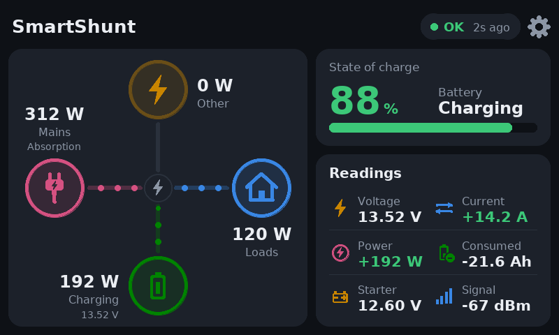
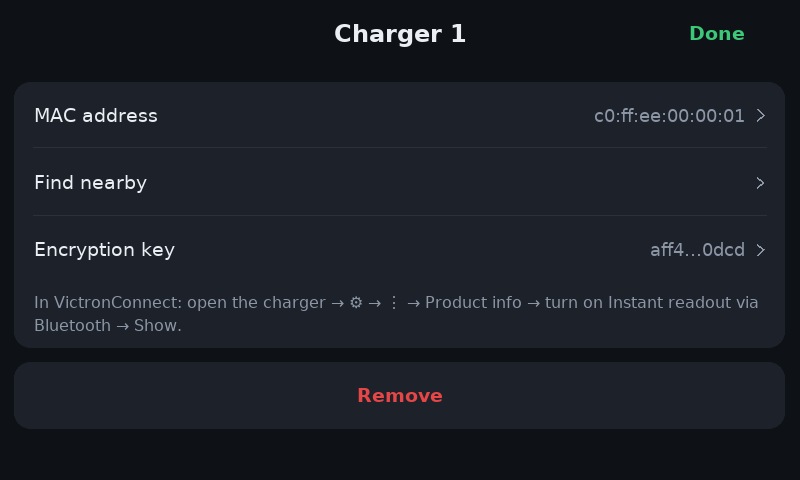
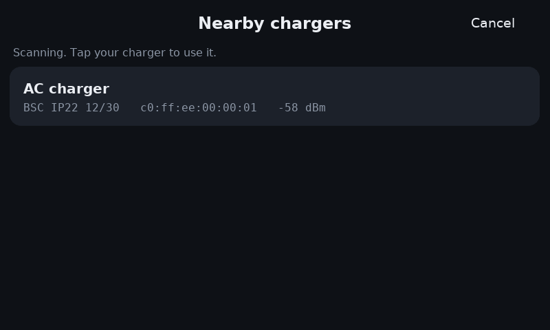
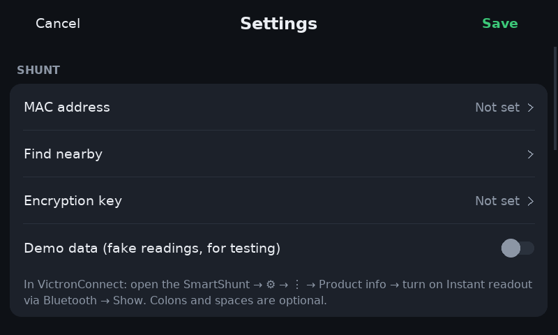
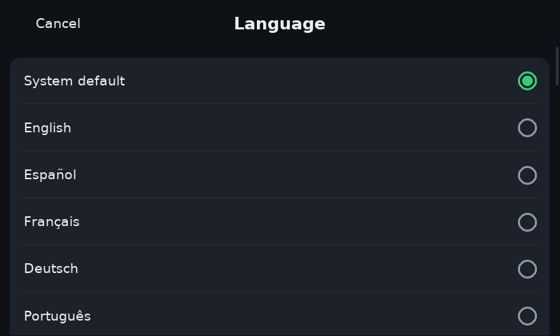
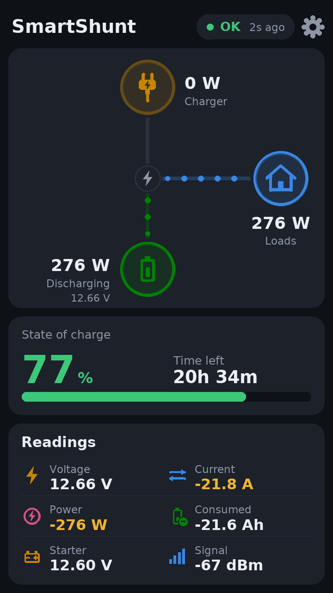

# Shunt Display for Raspberry Pi

The Raspberry Pi version of the SmartShunt display: live battery data from a **Victron SmartShunt** (or BMV-712), read over Bluetooth, on any HDMI or DSI touch screen. It has the same dashboard, settings and behaviour as the [Arduino display](../README.md#arduino-display) and the [Android app](../README.md#android-app), with dark and light themes, 45 languages and a real backlight-off screen timeout on screens that support it.

<p align="center">
  
  
</p>

> The images on this page are drawn by the app itself, rendered off-screen at 800×480 (and 720×1280 for portrait).

---

## Features

- **Power-flow dashboard:** a live picture of the charger, the battery and your loads, with dots moving along the line in the direction power is flowing. The shunt measures the battery only, so it can't tell mains from solar: there's one **Charger** input, which covers whatever is charging the battery.
- **Readings card:** voltage, current, power, consumed Ah, the aux input (starter voltage, midpoint or temperature) and signal strength, straight from the shunt. Nothing depends on the time of day, so no internet or clock is needed.
- **State of charge** big and colour-coded, with the time left while discharging.
- **Extra Victron chargers (optional):** add a Blue Smart IP22, SmartSolar MPPT or Orion XS (up to two) and each gets its own node with its output and charge stage. The loads are then worked out while charging too, and charging they don't account for (a non-Victron DC-DC charger, say) shows on its own node. See [Extra chargers](#extra-chargers).
- **No pairing:** it reads Victron's *Instant Readout* broadcasts, so it works alongside VictronConnect, the Arduino display and the Android app.
- **Any screen, any size:** the layout scales from a 3.5" 480×320 screen to a 1080p monitor, in landscape or portrait, and the display can be rotated 0°, 90°, 180° or 270° in settings.
- **Touch-screen setup:** tap the cog. A hex keypad for the MAC address and key, a **Find nearby** list of the battery monitors in range, and simple lists and steppers for everything else.
- **Screen timeout:** turns the backlight off after a set time on screens that allow it (the official Raspberry Pi touch displays and many DSI screens), or blanks to black on those that don't. A tap wakes it, and so does a shunt alarm.
- **Brightness** control on screens with an adjustable backlight.
- **Dark and light themes.**
- **45 languages**, the same translations as the Android app, with fonts for every script.
- **Colour-coded:** state of charge turns amber and red below levels you choose; current and power are green while charging and amber while discharging. Alarms are shown by name.
- **Handles problems:** "No signal" when the shunt goes quiet, flags a wrong key, switches Bluetooth back on if it was off, and restarts the scan if it stalls.
- **Plain text settings file** in the same `CONFIG.TXT` format as the Arduino display. On a dedicated display it's on the SD card's boot partition, so you can edit it on a PC.
- **Small and dependency-light:** Python with pygame and bleak. The decryption has no crypto library dependency.

---

## Screens

<table>
  <tr>
    <td align="center"><br><sub>With a Blue Smart IP22 added: it runs the loads and charges the battery</sub></td>
    <td align="center"><br><sub>The battery takes 450 W, the IP22 gives 312 W: 138 W comes from a DC-DC charger</sub></td>
  </tr>
  <tr>
    <td align="center"><br><sub>Setting up an extra charger</sub></td>
    <td align="center"><br><sub>Find nearby, for chargers</sub></td>
  </tr>
  <tr>
    <td align="center"><br><sub>An alarm, shown by name</sub></td>
    <td align="center"><br><sub>In German (Deutsch)</sub></td>
  </tr>
  <tr>
    <td align="center"><br><sub>Settings: tap the cog</sub></td>
    <td align="center"><br><sub>Settings, scrolled: language, theme, rotation, brightness, screen timeout</sub></td>
  </tr>
  <tr>
    <td align="center"><br><sub>Entering the MAC address</sub></td>
    <td align="center"><br><sub>Find nearby</sub></td>
  </tr>
  <tr>
    <td align="center"><br><sub>Choosing a language</sub></td>
    <td align="center"><br><sub>Portrait (720×1280)</sub></td>
  </tr>
</table>

---

## What you need

| Part | Notes |
|---|---|
| **Raspberry Pi with Bluetooth** | Pi 3, 3B+, 4, 5, 400, 500, Zero W or Zero 2 W all have it built in. Other models work with a USB Bluetooth adapter. A Pi Zero 2 W is plenty. |
| **A touch screen** | HDMI or DSI, any resolution: for example the official Raspberry Pi Touch Display or Touch Display 2, or a 5"/7" HDMI screen with USB touch. A plain monitor with a mouse works too. |
| **Raspberry Pi OS** | Bookworm or newer. **Raspberry Pi OS Lite** is the best choice for a dedicated display; the desktop version works too. |
| **Victron SmartShunt** | Or BMV-712, with *Instant readout via Bluetooth* turned on. |

---

## Installing

1. **Put Raspberry Pi OS on the SD card** with Raspberry Pi Imager. In its settings, set the Wi-Fi, a user name and SSH, so you can log in over the network.
2. **Get the files onto the Pi.** Log in and run:

   ```bash
   sudo apt install -y git
   git clone https://github.com/DnG-Crafts/SmartShunt-Display.git
   cd SmartShunt-Display/ShuntDisplayPi
   ```

3. **Run the installer:**

   ```bash
   sudo bash install.sh
   ```

   It installs pygame, bleak and the fonts, copies the app to `/opt/shunt-display`, and sets it to start full screen at every boot. If the Pi starts the desktop, it offers to switch it to start to the console instead, because a desktop would take over the screen. Then reboot: `sudo reboot`.

   The fonts for Chinese, Japanese and Korean are a large download (around 100 MB). If you don't need those languages, remove `fonts-noto-cjk` from `install.sh` before running it.

**Running inside the desktop instead:** `sudo bash install.sh --desktop` starts the app full screen when you log in, instead of at boot. You can also run it by hand at any time: `python3 /opt/shunt-display/shunt_display.py` (add `--window 800x480` for a window). **Esc** closes it.

**Trying it first:** you can run it straight from the folder without installing: `python3 shunt_display.py --demo --window 800x480`. This needs `sudo apt install python3-pygame python3-bleak`.

---

## First run

1. The status pill says **Setup / tap the cog**. Tap the **cog** (top right, or the status pill).
2. Tap **Find nearby** and choose your shunt, or tap **MAC address** and type it on the keypad.
3. Tap **Encryption key** and type the 32 characters. Both come from VictronConnect → SmartShunt → ⚙ → ⋮ → Product info → turn on *Instant readout via Bluetooth* → Show.
4. Tap **Save**.

Within a few seconds the dashboard fills in and the status pill at the top shows **OK** and how long ago the last reading arrived. The signal strength is in the Readings card.

> **Demo data** in settings shows moving fake readings, to check the screen before the shunt is nearby.

---

## Settings

Tap the cog to change settings on the screen. They're kept in a text file:

| Installed as | Settings file |
|---|---|
| Dedicated display (`sudo bash install.sh`) | `/boot/firmware/shunt-display.txt`: on the SD card's boot partition, so it can also be edited on a PC. |
| Desktop (`--desktop`) or run by hand | `~/.config/shunt-display/CONFIG.TXT` |

The file is read at start-up; it's written, with comments, the first time the app runs. Its format is the same as the Arduino display's `CONFIG.TXT`.

| On screen | In the file | Default | Meaning |
|---|---|---|---|
| MAC address | `mac` | – | Your shunt. Colons optional. |
| Encryption key | `key` | – | 32 hex characters. |
| Demo data | `demo` | `0` | `1` shows moving fake readings. |
| Chargers → Charger 1 / 2 | `charger1_mac`, `charger1_key`, `charger2_mac`, `charger2_key` | – | Extra Victron chargers (optional). Blank = not used. |
| Other charge source | `other_source` | `auto` | What to call charging the chargers don't account for: `auto` (*Charger*, or *Other* once a charger is added), `dcdc`, `solar`, `mains` or `alternator`. |
| Language | `language` | *(blank)* | Blank follows the system language; or a code such as `de`, `fr`, `ja`, `zh-TW`. |
| Theme | `theme` | `2` | `2` = dark, `1` = light. |
| Loads icon | `loads_icon` | `house` | The picture on the Loads node: `house`, `caravan` or `boat`. |
| Screen rotation | `screen_rotation` | `0` | `0`, `90`, `180` or `270` degrees, for screens mounted sideways or upside down. |
| Brightness | `brightness` | `100` | 10–100 %. Only shown if the screen's backlight can be controlled. |
| Screen off after | `screen_off` | `0` | Seconds without a touch before the screen turns off. `0` = never. |
| "No signal" after | `stale_after` | `30` | Seconds without data before values turn grey. |
| Charge amber below | `soc_amber` | `50` | State of charge (%) below which it turns amber. |
| Charge red below | `soc_red` | `20` | State of charge (%) below which it turns red. |

The Arduino-only settings (`rotation`, `lcd_chip`, `invert`, `touch_cal`) aren't used here, but they're kept, so the same file can go back to the Arduino display. The Arduino display flags the Pi-only lines as "config error", so delete those before copying the file across.

Settings left open and untouched for 90 seconds close without saving, like on the Arduino display.

### Extra chargers

The shunt only measures the battery, so by itself the display can't tell which charger is running, or what the loads use while the battery charges. Victron chargers that send *Instant readout* can fill that in: a **Blue Smart IP22** (firmware v3.61 or newer; other Victron AC chargers work the same way), a **SmartSolar or BlueSolar MPPT**, or an **Orion XS** DC-DC charger.

1. In VictronConnect, open the charger → ⚙ → ⋮ → **Product info**, turn on **Instant readout via Bluetooth** and tap **Show**.
2. In the display's settings, tap **Charger 1** under **Chargers**. Use **Find nearby** (it lists Victron chargers) or type the MAC address, then type the key. **Done**, then **Save**.

The first charger appears on the left of the flow picture, with its output and charge stage (Bulk, Absorption, Float…). With *K* watts from the Victron chargers and *P* watts into the battery, the **loads** are *K* − *P*, and anything the battery gets beyond *K* shows on the top node as **other** charging (for example a Redarc or another non-Victron DC-DC charger); **Other charge source** sets its name and icon. Both are the smallest amounts that fit the readings: if an unknown charger and the loads run at the same time, only their difference can be seen.

A second charger takes the top place, and then there's no "other" node. A charger that goes quiet shows **No signal** and is left out of the sums. **Remove** on a charger's page takes it off the dashboard.

---

## Status messages

| Status | Detail | Meaning |
|---|---|---|
| **OK** | `3s ago` | Receiving data: time since the last packet. The signal strength is in the Readings card. |
| **Searching** | – | Scanning, but the shunt hasn't been heard yet. |
| **No signal** | `45s ago` | Nothing heard for longer than *"No signal" after*. Values turn grey. |
| **ALARM** | alarm name | The shunt is reporting an alarm. The screen wakes up. |
| **Bad key** | `check key` | Your shunt is heard, but the key doesn't match. |
| **Setup** | `tap the cog` | MAC address or key not entered yet. |
| **Bluetooth off** | `retrying…` | Bluetooth is switched off or blocked. The app switches it on (`rfkill unblock`, `bluetoothctl power on`) and retries. |
| **BLE fail** | `retrying…` | The scan couldn't start. It retries every 15 seconds. |
| **No BLE** | `no adapter` | The Pi has no Bluetooth adapter. |

Signal strength guide: −60 dBm is strong, −80 dBm is fine, and below −90 dBm you'll see dropouts.

---

## Troubleshooting

<details>
<summary><b>Nothing on the screen after a reboot</b></summary>

Check the log: `journalctl -u shunt-display -b`. If it says the display couldn't be opened, the desktop is probably running and holding the screen: run `sudo raspi-config` → System Options → Boot / Auto Login → **Console**, or reinstall with `--desktop`.

The app tries each graphics card (`/dev/dri/card*`) in turn, then falls back to drawing straight to the framebuffer (`/dev/fb0`) with touch read from the input devices. On screens where that picks the wrong one, set it yourself with `SHUNT_FB=/dev/fb1` in the service (`sudo systemctl edit shunt-display`, then add `Environment=SHUNT_FB=/dev/fb1` under `[Service]`).
</details>

<details>
<summary><b>Touches land in the wrong place</b></summary>

If the screen is rotated in settings, touch is rotated to match. If the screen itself is mounted sideways and the *touch panel* is rotated by the system (some DSI screens have a `dtoverlay` rotation option), set only one of the two: either the app's **Screen rotation** or the system's.
</details>

<details>
<summary><b>The screen timeout only goes black</b></summary>

The backlight can only be switched off if the screen driver offers it under `/sys/class/backlight` (the official touch displays do; most HDMI screens don't). Otherwise the app blanks the screen to black instead. The **Brightness** setting is only shown when there's a backlight to control.
</details>

<details>
<summary><b>"No signal" or "Bad key"</b></summary>

- **Bad key:** re-enter the key from VictronConnect.
- **No signal:** check the MAC address, and that *Instant readout via Bluetooth* is still on (a shunt firmware update can turn it off). The Pi's Bluetooth antenna is small, so keep it within a few metres of the shunt, and not inside a metal box.
</details>

<details>
<summary><b>Squares instead of text in some languages</b></summary>

The fonts for that script aren't installed: `sudo apt install fonts-noto-core fonts-noto-cjk`.
</details>

**Updating:** `cd` to the repository folder, run `git pull`, then `sudo bash install.sh` again. Your settings file is kept.

**Removing:** `sudo bash install.sh --uninstall`. Settings files are left in place.

---

## Project layout

```
ShuntDisplayPi/
├── shunt_display.py        start here: python3 shunt_display.py [--demo] [--window 800x480]
├── install.sh              installer: dedicated display (default), --desktop, --uninstall
├── shuntdisplay/
│   ├── app.py              main loop: readings, status, screen timeout, pages
│   ├── dashboard.py        the power-flow dashboard (landscape and portrait)
│   ├── ui.py               settings, keypad, lists, stepper, Find nearby, confirm box
│   ├── gfx.py              themes, text with font fallback, shapes and icons
│   ├── display.py          screen, rotation, touch input, backlight
│   ├── fbscreen.py         framebuffer fallback with its own touch input
│   ├── ble.py              Bluetooth scanning (bleak / BlueZ) in a background thread
│   ├── victron.py          Instant Readout decoder (shunt and chargers), with its own AES-128
│   ├── config.py           settings and the CONFIG.TXT format
│   ├── i18n.py             translations, plural rules, fonts
│   └── lang/*.json         the 45 languages (from the Android app, plus the Pi's own strings)
├── tests/                  python3 -m unittest discover tests
└── docs/images/            screenshots
```

The tests check the decoder against the victron-ble test vectors, the settings file format, that every language is complete, and draw every screen off-screen in several sizes and languages.

---

## Credits

- **[victron-ble](https://github.com/keshavdv/victron-ble)** by keshavdv: the reference for the Instant Readout format and the source of the decoder's test vectors.
- **[pygame](https://www.pygame.org)** (SDL) for the screen and touch, and **[bleak](https://github.com/hbldh/bleak)** for Bluetooth.
- **DejaVu** and **Noto** fonts.

This project isn't affiliated with or endorsed by Victron Energy or Raspberry Pi Ltd. Victron, SmartShunt, BMV and VictronConnect are trademarks of Victron Energy B.V.
